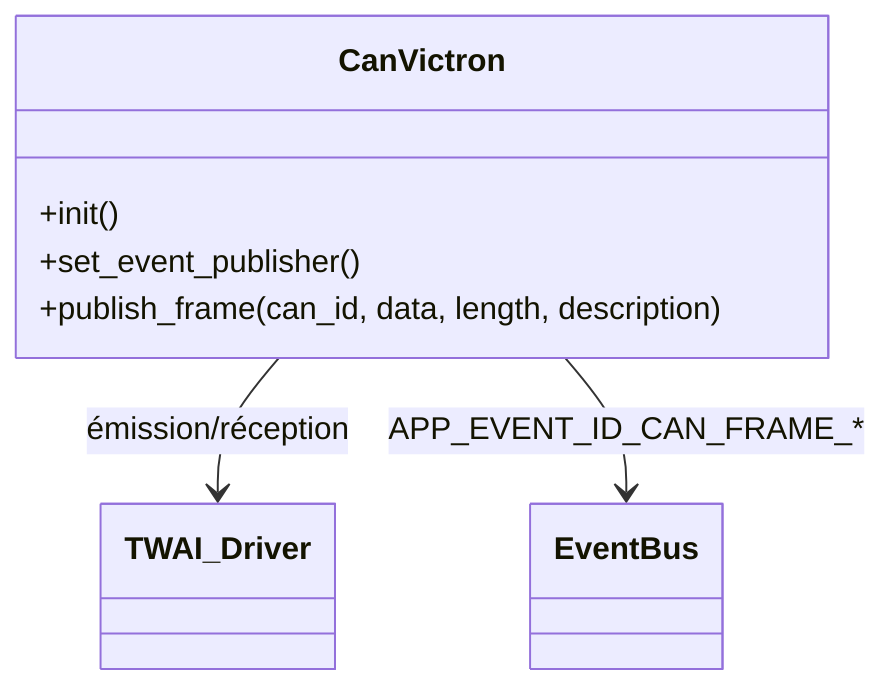

# Module `can_victron`

## Références
- `main/can_victron/can_victron.h`
- `main/can_victron/can_victron.c`
- `main/include/app_events.h`

## Diagramme UML

## Rôle et responsabilités
Le module `can_victron` encapsule l'interface CAN (TWAI) dédiée à la communication avec l'écosystème Victron. Il :
- démarre et configure le driver TWAI (broches, mode normal, files RX/TX) ;
- publie les trames reçues ainsi que les trames émises sous forme d'évènements (JSON) ;
- gère un keepalive périodique pour vérifier la présence des contrôleurs Victron ;
- fournit un callback bas niveau `can_victron_publish_frame()` utilisé par `can_publisher` pour envoyer des trames préparées.

Les broches `CONFIG_TINYBMS_CAN_VICTRON_TX_GPIO` (par défaut `GPIO7`) et
`CONFIG_TINYBMS_CAN_VICTRON_RX_GPIO` (par défaut `GPIO6`) correspondent à
la paire CAN1H/CAN1L du connecteur principal de la carte ESP32-CAN-X2, en
alignement avec l'exemple de passerelle CAN officiel qui épingle TWAI sur
ces GPIO.【F:main/Kconfig.projbuild†L226-L241】【F:archive/docs/reference/board_pinout_esp32_can_x2.md†L1-L26】
la paire CAN1H/CAN1L du connecteur principal de la carte ESP32-CAN-X2.【F:main/Kconfig.projbuild†L226-L241】【F:archive/docs/reference/board_pinout_esp32_can_x2.md†L1-L18】

## Initialisation
1. `can_victron_set_event_publisher()` stocke la fonction de publication.
2. `can_victron_init()` configure les paramètres TWAI (bitrate via `sdkconfig`, broches `CONFIG_TINYBMS_CAN_VICTRON_TX_GPIO/RX_GPIO`) et crée la tâche `can_victron_task()` si ESP-IDF est disponible.
3. Les buffers d'évènements (`s_can_raw_events`, `s_can_decoded_events`) sont initialisés pour stocker des JSON prêts à publier.
4. La tâche de service lit en boucle les messages TWAI, gère les timeouts, envoie les keepalive et publie les trames via le bus d'évènements.

## Gestion des trames
- **Réception** : `can_victron_handle_rx_message()` formate deux payloads JSON : une représentation brute (`type=can_raw`, direction `rx`) et une représentation « décodée » (avec `description` lorsque disponible). Les évènements correspondants sont `APP_EVENT_ID_CAN_FRAME_RAW` et `APP_EVENT_ID_CAN_FRAME_DECODED`.
- **Émission** : `can_victron_publish_frame()` accepte une trame et description. Elle écrit sur le bus CAN via `twai_transmit()` (timeout configurable), puis publie les évènements `can_raw` (direction `tx`) et `can_decoded`.
- **Bufferisation** : un index circulaire protégé (`s_event_slot_lock`) répartit les messages dans `CAN_VICTRON_EVENT_BUFFERS` pour éviter la corruption de payload.

## Keepalive
- Le PGN keepalive Victron (`CAN_VICTRON_KEEPALIVE_ID = 0x305`) est envoyé périodiquement (`CONFIG_TINYBMS_CAN_KEEPALIVE_INTERVAL_MS`).
- `can_victron_process_keepalive_rx()` valide la réception de la réponse et met à jour les timestamps `s_last_keepalive_rx_ms`.
- Si aucun keepalive n'est reçu avant `CONFIG_TINYBMS_CAN_KEEPALIVE_TIMEOUT_MS`, une reconnexion du driver est tentée.

## Concurrence et tâches
- `s_twai_mutex` protège l'accès concurrent au driver.
- `can_victron_task()` (priorité `tskIDLE_PRIORITY + 6`) gère la boucle principale : lecture TWAI, keepalive, gestion des erreurs, reprise du driver après faute.
- En cas de sortie de la tâche (échec d'initialisation), les logs indiquent la cause et le module reste en mode dégradé.

## Intégration
- `can_publisher` appelle `can_victron_publish_frame()` pour transmettre les trames générées à partir des données TinyBMS.
- `mqtt_gateway` et `web_server` consomment les évènements `can_raw`/`can_decoded` pour alimenter MQTT et WebSocket.

## Extensibilité
Pour ajouter un décodage enrichi :
1. Étendre `can_victron_emit_events()` pour inclure un champ JSON supplémentaire (par exemple `bus`, `source`).
2. Injecter des descriptions contextuelles lors des appels à `can_victron_publish_frame()`.
3. Ajuster le nombre de buffers (`CAN_VICTRON_EVENT_BUFFERS`) si le flux s'intensifie.
