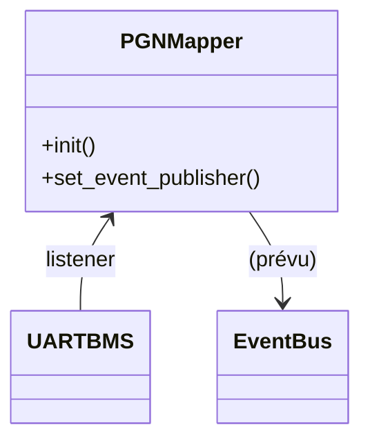

# Module `pgn_mapper`

## Références
- `main/pgn_mapper/pgn_mapper.h`
- `main/pgn_mapper/pgn_mapper.c`
- `main/uart_bms/uart_bms.h`
- `main/include/app_events.h`

## Diagramme UML

## Rôle et état actuel
`pgn_mapper` est prévu pour traduire les données TinyBMS vers des messages CAN Victron complexes ou pour enrichir les notifications applicatives. Actuellement, le module se contente d'écouter les mises à jour TinyBMS via `uart_bms_register_listener()` et de mémoriser la dernière structure `uart_bms_live_data_t`. Aucun évènement n'est encore publié, mais les logs indiquent la réception des données (`ESP_LOGD`). Le hook `event_bus_publish_fn_t` est conservé pour permettre l'émission future d'évènements sans modifier l'initialisation globale.

## Intégration avec la télémétrie existante
- La télémétrie TinyBMS est déjà exposée côté web par `monitoring`, qui convertit `uart_bms_live_data_t` en JSON et publie `APP_EVENT_ID_TELEMETRY_SAMPLE`. Le serveur web relaie ensuite ces messages vers les clients (WebSocket).
- `can_publisher` reste responsable de l'encodage CAN : il reçoit les mêmes mises à jour TinyBMS et produit la dizaine de PGN Victron attendus (`0x351`, `0x355`, `0x356`, `0x35A`, etc.) avant de les envoyer via `can_victron` sur le bus BMS.
- Dans cette architecture, `pgn_mapper` n'est pas requis pour la diffusion actuelle : il agit en observateur passif et maintient un cache prêt à être enrichi ou transformé.

## Quand l'utiliser ?
- **Extensions futures** : pour calculer de nouveaux PGN, agrégations métier ou notifications spécifiques qui ne sont pas couvertes par `monitoring` ou `can_publisher`.
- **Publications applicatives** : lorsqu'un nouveau flux doit être mis à disposition (web, automation, alerting), implémentez la transformation dans `pgn_mapper` puis publiez-la via l'Event Bus ; le serveur web pourra alors la relayer sans changement structurel.
- **Cas à éviter** : ré-exposer la télémétrie brute TinyBMS côté web. Cela ferait doublon avec `monitoring` et risquerait d'introduire des divergences de format ou de cadence.

## Responsabilités planifiées
- Maintenir un cache des dernières valeurs TinyBMS afin de calculer des trames PGN dérivées (par exemple `0x351` pour DVCC) ou des dérivés statistiques.
- Fournir un point de collecte pour convertir les données en format Victron standard, potentiellement en collaboration avec `can_publisher`.
- Publier des évènements sur `APP_EVENT_ID_CAN_FRAME_DECODED` ou d'autres topics lorsqu'une traduction est disponible.

## Extension recommandée
Pour achever le module :
1. Implémenter des fonctions de conversion (similaires à celles de `conversion_table.c`).
2. Publier les trames calculées via `event_bus_event_t` (payload structuré ou JSON).
3. Synchroniser les périodes de publication avec `can_publisher` afin d'éviter des doublons.
4. Ajouter des tests unitaires couvrant la transformation TinyBMS -> PGN.
