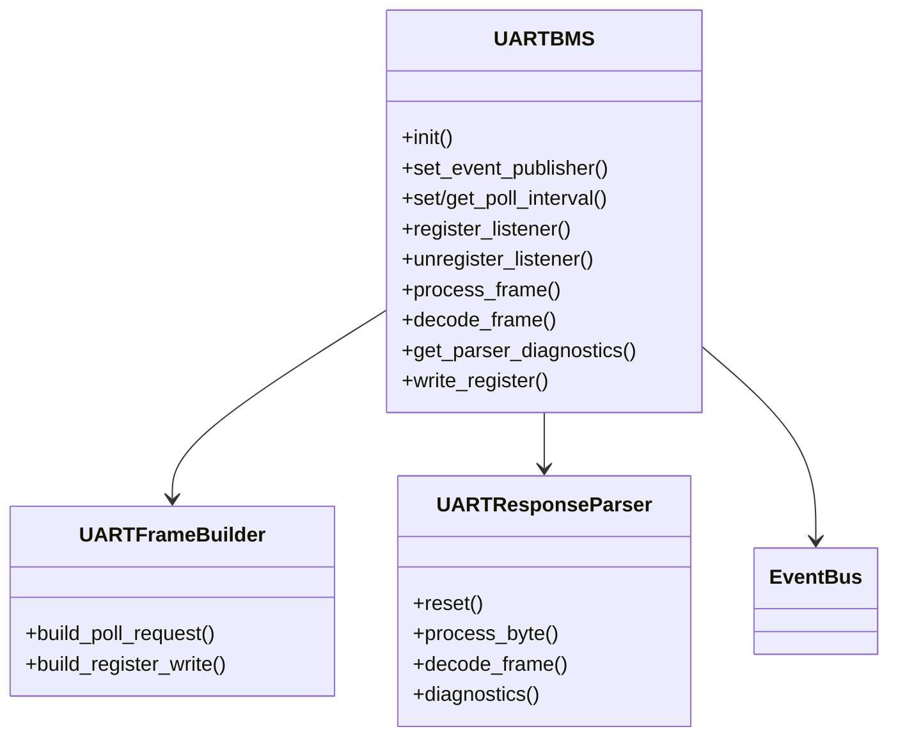

# Module `uart_bms`

## Références
- `main/uart_bms/uart_bms.h`
- `main/uart_bms/uart_bms.cpp`
- `main/uart_bms/uart_bms_protocol.h`
- `main/uart_bms/uart_bms_protocol.c`
- `main/uart_bms/uart_frame_builder.h`
- `main/uart_bms/uart_frame_builder.cpp`
- `main/uart_bms/uart_response_parser.h`
- `main/uart_bms/uart_response_parser.cpp`
- `main/include/app_events.h`

## Diagramme UML

## Rôle et responsabilités
Le module `uart_bms` pilote la communication UART avec le TinyBMS : émission périodique de requêtes, réception/décodage des trames, diffusion des échantillons et gestion des écritures de registres. Il fournit également une API d'abonnement pour les autres modules (C et C++), et publie différents évènements (`APP_EVENT_ID_BMS_LIVE_DATA`, `APP_EVENT_ID_UART_FRAME_RAW`, `APP_EVENT_ID_UART_FRAME_DECODED`).【F:main/uart_bms/uart_bms.cpp†L271-L338】【F:main/include/app_events.h†L18-L43】

## Paramètres de polling et requêtes UART
- **Intervalle de polling** : bornes `UART_BMS_MIN_POLL_INTERVAL_MS = 100 ms`, `UART_BMS_MAX_POLL_INTERVAL_MS = 1000 ms`, valeur par défaut `UART_BMS_DEFAULT_POLL_INTERVAL_MS = 250 ms`. La fonction `uart_bms_set_poll_interval_ms()` applique ces contraintes sous verrou (`s_poll_interval_lock`).【F:main/uart_bms/uart_bms.h†L13-L37】【F:main/uart_bms/uart_bms.cpp†L161-L245】
- **Timeout de réponse** : `UART_BMS_RESPONSE_TIMEOUT_MS = 200 ms`, également utilisé comme valeur de repli pour les écritures synchrones.【F:main/uart_bms/uart_bms.h†L16-L19】【F:main/uart_bms/uart_bms.cpp†L714-L788】
- **Requête de poll TinyBMS** : `uart_frame_builder_build_poll_request()` assemble une trame contenant la séquence d’adresses `g_uart_bms_poll_addresses` (29 mots). L’ordre est optimisé pour aligner les lectures multi-mots (uptime, tension/courant flottants, SoC…).【F:main/uart_bms/uart_frame_builder.cpp†L36-L87】【F:main/uart_bms/uart_bms_protocol.c†L314-L332】

| Ordre | Adresse | Description |
| --- | --- | --- |
| 1 | 0x0020 | Lifetime counter (LSW) |
| 2 | 0x0021 | Lifetime counter (MSW) |
| 3 | 0x0024 | Pack voltage (LSW) |
| 4 | 0x0025 | Pack voltage (MSW) |
| 5 | 0x0026 | Pack current (LSW) |
| 6 | 0x0027 | Pack current (MSW) |
| 7 | 0x0028 | Min cell voltage |
| 8 | 0x0029 | Max cell voltage |
| 9 | 0x002A | External temperature #1 |
| 10 | 0x002B | External temperature #2 |
| 11 | 0x002D | State of Health |
| 12 | 0x002E | State of Charge (LSW) |
| 13 | 0x002F | State of Charge (MSW) |
| 14 | 0x0030 | Internal temperature |
| 15 | 0x0032 | System status |
| 16 | 0x0033 | Need balancing bits |
| 17 | 0x0034 | Real balancing bits |
| 18 | 0x0071 | Pack temperature min/max |
| 19 | 0x0131 | Peak discharge cutoff |
| 20 | 0x0132 | Battery capacity |
| 21 | 0x0133 | Series cell count |
| 22 | 0x013B | Overvoltage cutoff |
| 23 | 0x013C | Undervoltage cutoff |
| 24 | 0x013D | Discharge overcurrent cutoff |
| 25 | 0x013E | Charge overcurrent cutoff |
| 26 | 0x013F | Overheat cutoff |
| 27 | 0x01F4 | Hardware/changes version |
| 28 | 0x01F5 | Public firmware + flags |
| 29 | 0x01F6 | Internal firmware version |

- **Polling task** : tâche FreeRTOS dédiée (`UART_BMS_TASK_PRIORITY = 12`, pile 4096 octets) qui lit en boucle via `uart_read_bytes()` et pousse les octets au parser incrémental (`UartResponseParser::processByte`).【F:main/uart_bms/uart_bms.cpp†L92-L159】【F:main/uart_bms/uart_response_parser.cpp†L47-L164】

## Détails des registres TinyBMS
Chaque réponse TinyBMS est décomposée selon la table de métadonnées `g_uart_bms_registers`. Les types reflètent le décodage (entier signé/non signé, float IEEE754, paire de 2×8 bits). Les champs « primary / secondary » indiquent le mapping vers `TinyBMS_LiveData`.

| ID | Adresse | Mots | Type | Échelle | Champ principal | Champ secondaire | Nom | Unité | Commentaire |
| --- | --- | --- | --- | --- | --- | --- | --- | --- | --- |
| UART_BMS_REGISTER_LIFETIME_COUNTER | 0x0020 | 2 | UART_BMS_VALUE_UINT32 | 1.0f | UART_BMS_FIELD_UPTIME_SECONDS | UART_BMS_FIELD_NONE | Tiny BMS lifetime counter | s | Read via UART/CAN (Reg:32) |
| UART_BMS_REGISTER_PACK_VOLTAGE | 0x0024 | 2 | UART_BMS_VALUE_FLOAT32 | 1.0f | UART_BMS_FIELD_PACK_VOLTAGE | UART_BMS_FIELD_NONE | Battery Pack Voltage | V | Read via UART/CAN (Reg:36) |
| UART_BMS_REGISTER_PACK_CURRENT | 0x0026 | 2 | UART_BMS_VALUE_FLOAT32 | 1.0f | UART_BMS_FIELD_PACK_CURRENT | UART_BMS_FIELD_NONE | Battery Pack Current | A | Read via UART/CAN (Reg:38) |
| UART_BMS_REGISTER_MIN_CELL_VOLTAGE | 0x0028 | 1 | UART_BMS_VALUE_UINT16 | 1.0f | UART_BMS_FIELD_MIN_CELL_MV | UART_BMS_FIELD_NONE | Min Cell Voltage | mV | Read via UART/CAN (Reg:40) |
| UART_BMS_REGISTER_MAX_CELL_VOLTAGE | 0x0029 | 1 | UART_BMS_VALUE_UINT16 | 1.0f | UART_BMS_FIELD_MAX_CELL_MV | UART_BMS_FIELD_NONE | Max Cell Voltage | mV | Read via UART/CAN (Reg:41) |
| UART_BMS_REGISTER_EXTERNAL_TEMPERATURE_1 | 0x002A | 1 | UART_BMS_VALUE_INT16 | 0.1f | UART_BMS_FIELD_AVERAGE_TEMPERATURE | UART_BMS_FIELD_NONE | External Temperature #1 | °C | Read via UART/CAN (Reg:42) |
| UART_BMS_REGISTER_EXTERNAL_TEMPERATURE_2 | 0x002B | 1 | UART_BMS_VALUE_INT16 | 0.1f | UART_BMS_FIELD_AUXILIARY_TEMPERATURE | UART_BMS_FIELD_NONE | External Temperature #2 | °C | Read via UART/CAN (Reg:43) |
| UART_BMS_REGISTER_STATE_OF_HEALTH | 0x002D | 1 | UART_BMS_VALUE_UINT16 | 0.002f | UART_BMS_FIELD_STATE_OF_HEALTH | UART_BMS_FIELD_NONE | State Of Health | % | Read via UART/CAN (Reg:45) |
| UART_BMS_REGISTER_STATE_OF_CHARGE | 0x002E | 2 | UART_BMS_VALUE_UINT32 | 0.000001f | UART_BMS_FIELD_STATE_OF_CHARGE | UART_BMS_FIELD_NONE | State Of Charge | % | Read via UART/CAN (Reg:46) |
| UART_BMS_REGISTER_INTERNAL_TEMPERATURE | 0x0030 | 1 | UART_BMS_VALUE_INT16 | 0.1f | UART_BMS_FIELD_MOS_TEMPERATURE | UART_BMS_FIELD_NONE | Internal Temperature | °C | Read via UART/CAN (Reg:48) |
| UART_BMS_REGISTER_SYSTEM_STATUS | 0x0032 | 1 | UART_BMS_VALUE_UINT16 | 1.0f | UART_BMS_FIELD_SYSTEM_STATUS | UART_BMS_FIELD_NONE | System Status (online/offline) | - | Read via UART/CAN (Reg:50) |
| UART_BMS_REGISTER_NEED_BALANCING | 0x0033 | 1 | UART_BMS_VALUE_UINT16 | 1.0f | UART_BMS_FIELD_NEED_BALANCING | UART_BMS_FIELD_NONE | Need Balancing | - | Read via UART/CAN (Reg:51) |
| UART_BMS_REGISTER_REAL_BALANCING_BITS | 0x0034 | 1 | UART_BMS_VALUE_UINT16 | 1.0f | UART_BMS_FIELD_BALANCING_BITS | UART_BMS_FIELD_NONE | Real Balancing Bits | - | Read via UART/CAN (Reg:52) |
| UART_BMS_REGISTER_PACK_TEMPERATURE_MIN_MAX | 0x0071 | 1 | UART_BMS_VALUE_INT8_PAIR | 1.0f | UART_BMS_FIELD_PACK_TEMPERATURE_MIN | UART_BMS_FIELD_PACK_TEMPERATURE_MAX | Pack Temperature Min | °C | Read via UART/CAN (Reg:113, LSB = Min, MSB = Max) |
| UART_BMS_REGISTER_PEAK_DISCHARGE_CURRENT_CUTOFF | 0x0131 | 1 | UART_BMS_VALUE_UINT16 | 1.0f | UART_BMS_FIELD_PEAK_DISCHARGE_CURRENT_LIMIT | UART_BMS_FIELD_NONE | Peak Discharge Current Cutoff | A | Read via CAN (Reg:305) |
| UART_BMS_REGISTER_BATTERY_CAPACITY | 0x0132 | 1 | UART_BMS_VALUE_UINT16 | 0.01f | UART_BMS_FIELD_BATTERY_CAPACITY | UART_BMS_FIELD_NONE | Battery Capacity | Ah | Read via UART/CAN (Reg:306) |
| UART_BMS_REGISTER_SERIES_CELL_COUNT | 0x0133 | 1 | UART_BMS_VALUE_UINT16 | 1.0f | UART_BMS_FIELD_SERIES_CELL_COUNT | UART_BMS_FIELD_NONE | Number Of Series Cells | cell | Read via CAN (Reg:307) |
| UART_BMS_REGISTER_OVERVOLTAGE_CUTOFF | 0x013B | 1 | UART_BMS_VALUE_UINT16 | 1.0f | UART_BMS_FIELD_OVERVOLTAGE_CUTOFF | UART_BMS_FIELD_NONE | Overvoltage Cutoff | mV | Read via UART/CAN (Reg:315) |
| UART_BMS_REGISTER_UNDERVOLTAGE_CUTOFF | 0x013C | 1 | UART_BMS_VALUE_UINT16 | 1.0f | UART_BMS_FIELD_UNDERVOLTAGE_CUTOFF | UART_BMS_FIELD_NONE | Undervoltage Cutoff | mV | Read via UART/CAN (Reg:316) |
| UART_BMS_REGISTER_DISCHARGE_OVER_CURRENT_CUTOFF | 0x013D | 1 | UART_BMS_VALUE_UINT16 | 1.0f | UART_BMS_FIELD_DISCHARGE_OVER_CURRENT_LIMIT | UART_BMS_FIELD_NONE | Discharge Over-current Cutoff | A | Read via UART/CAN (Reg:317) |
| UART_BMS_REGISTER_CHARGE_OVER_CURRENT_CUTOFF | 0x013E | 1 | UART_BMS_VALUE_UINT16 | 1.0f | UART_BMS_FIELD_CHARGE_OVER_CURRENT_LIMIT | UART_BMS_FIELD_NONE | Charge Over-current Cutoff | A | Read via UART/CAN (Reg:318) |
| UART_BMS_REGISTER_OVERHEAT_CUTOFF | 0x013F | 1 | UART_BMS_VALUE_INT16 | 1.0f | UART_BMS_FIELD_OVERHEAT_CUTOFF | UART_BMS_FIELD_NONE | Overheat Cutoff | °C | Read via UART/CAN (Reg:319) |
| UART_BMS_REGISTER_HARDWARE_VERSION | 0x01F4 | 1 | UART_BMS_VALUE_UINT16 | 1.0f | UART_BMS_FIELD_HARDWARE_VERSION | UART_BMS_FIELD_HARDWARE_CHANGES_VERSION | Hardware/Changes Version | - | Reg:500. HW Ver (LSB), HW Changes Ver (MSB) |
| UART_BMS_REGISTER_PUBLIC_FIRMWARE_FLAGS | 0x01F5 | 1 | UART_BMS_VALUE_UINT16 | 1.0f | UART_BMS_FIELD_FIRMWARE_VERSION | UART_BMS_FIELD_FIRMWARE_FLAGS | Public Firmware/Flags | - | Reg:501. Public FW Ver (LSB), Flags (MSB) |
| UART_BMS_REGISTER_INTERNAL_FIRMWARE_VERSION | 0x01F6 | 1 | UART_BMS_VALUE_UINT16 | 1.0f | UART_BMS_FIELD_INTERNAL_FIRMWARE_VERSION | UART_BMS_FIELD_NONE | Internal Firmware Version | - | Reg:502 |

## API principale
- `uart_bms_init()` : configure l'UART (GPIO, débit, buffers), installe la tâche de polling, prépare la requête standard TinyBMS, initialise le parser et le mutex de commande. Les broches proviennent des options `CONFIG_TINYBMS_UART_TX_GPIO`/`CONFIG_TINYBMS_UART_RX_GPIO` exposées dans `menuconfig`.【F:main/uart_bms/uart_bms.cpp†L41-L159】【F:main/Kconfig.projbuild†L215-L234】
- `uart_bms_set_event_publisher()` : enregistre la fonction de publication sur le bus d’évènements.【F:main/uart_bms/uart_bms.cpp†L168-L186】
- `uart_bms_set_poll_interval_ms()` / `uart_bms_get_poll_interval_ms()` : manipulent l’intervalle sous verrou et redémarrent la temporisation de la tâche de polling.【F:main/uart_bms/uart_bms.cpp†L188-L245】
- `uart_bms_register_listener()` / `uart_bms_unregister_listener()` : gèrent quatre slots de callbacks C, avec miroir C++ via `uart_bms_register_shared_listener()` pour les structures `TinyBMS_LiveData`.【F:main/uart_bms/uart_bms.cpp†L247-L338】【F:main/uart_bms/uart_bms.cpp†L790-L858】
- `uart_bms_process_frame()` / `uart_bms_decode_frame()` : décodent une trame externe (tests, capture).【F:main/uart_bms/uart_bms.cpp†L610-L688】
- `uart_bms_get_parser_diagnostics()` : expose les compteurs CRC, timeout, erreurs d’entête… via `uart_bms_parser_diagnostics_t`.【F:main/uart_bms/uart_bms.cpp†L871-L879】

## Gestion des écritures TinyBMS
- `uart_bms_write_register()` suspend temporairement la tâche de polling, purge l’UART, construit une trame `WRITE_SINGLE`, attend l’ACK (`uart_bms_wait_for_ack`) puis relit le registre pour confirmer la valeur (renvoyée via `readback_raw`). Les timeouts (prise de mutex, ACK, read-back) sont bornés par `UART_BMS_RESPONSE_TIMEOUT_MS` ou `timeout_ms` fourni.【F:main/uart_bms/uart_bms.cpp†L705-L789】
- Les écritures utilisent la même pile d’évènements : si la réponse TinyBMS arrive, le parser publie aussi les trames RAW/JSON actualisées, garantissant la cohérence des consommateurs.【F:main/uart_bms/uart_bms.cpp†L558-L607】

## Publication d'évènements
- **Trames brutes** : JSON hexadécimal sur `APP_EVENT_ID_UART_FRAME_RAW` (écoute WebSocket + MQTT).【F:main/uart_bms/uart_bms.cpp†L558-L607】【F:main/include/app_events.h†L28-L33】
- **Trames décodées** : JSON structuré sur `APP_EVENT_ID_UART_FRAME_DECODED`.【F:main/uart_bms/uart_bms.cpp†L558-L607】
- **Télémétrie** : structure `uart_bms_live_data_t` sur `APP_EVENT_ID_BMS_LIVE_DATA`, point d’entrée pour `monitoring`, `can_publisher`, `pgn_mapper`…【F:main/uart_bms/uart_bms.cpp†L271-L338】

## Diagnostics et extensibilité
- `uart_bms_parser_diagnostics_t` agrège `frames_total`, `frames_valid`, erreurs CRC, timeouts, registres manquants – utile pour le panneau de monitoring ou MQTT.【F:main/uart_bms/uart_response_parser.cpp†L47-L164】【F:main/uart_bms/uart_bms.cpp†L862-L879】
- Pour ajouter un registre TinyBMS : étendre `uart_bms_live_data_t`, ajouter la métadonnée correspondante (`g_uart_bms_registers`) et ajuster `uart_response_parser.cpp` pour propager la donnée.【F:main/uart_bms/uart_response_parser.cpp†L166-L330】【F:main/uart_bms/uart_bms_protocol.c†L5-L303】
- Pour de nouvelles commandes UART : enrichir `uart_frame_builder.cpp` (ex. `build_write_multi`) et exposer une API adaptée en protégeant le mutex de commande.【F:main/uart_bms/uart_frame_builder.cpp†L36-L140】【F:main/uart_bms/uart_bms.cpp†L705-L789】
Le module `uart_bms` pilote la communication UART avec le TinyBMS : émission périodique de requêtes, réception/décodage des trames, diffusion des échantillons et gestion des écritures de registres. Il fournit également une API d'abonnement pour les autres modules (C et C++), et publie différents évènements (`APP_EVENT_ID_BMS_LIVE_DATA`, `APP_EVENT_ID_UART_FRAME_RAW`, `APP_EVENT_ID_UART_FRAME_DECODED`).

## Architecture
- **Tâche de polling** : une tâche FreeRTOS (`UART_BMS_TASK_PRIORITY=12`) envoie la requête poll (`uart_frame_builder_build_poll_request`) à intervalle configurable et attend la réponse via `uart_read_bytes`.
- **Parser incrémental** : `UartResponseParser` traite les octets reçus, vérifie l'en-tête, la longueur et le CRC, puis construit un `uart_bms_live_data_t` complet.
- **Bufferisation** : les structures circulaires `s_event_buffers` et `s_uart_raw_json/s_uart_decoded_json` évitent de publier des pointeurs volatils. Chaque évènement contient une copie stable des données.
- **Listeners** : deux registres parallèles de 4 slots chacun : callbacks C (`uart_bms_register_listener`) et callbacks C++ (`uart_bms_register_shared_listener`) consommant la structure `TinyBMS_LiveData` partagée (`shared_data.h`).

## API principale
- `uart_bms_init()` : configure l'UART (pins, vitesse, buffers), installe la tâche de polling, prépare la requête standard TinyBMS, initialise le parser et le mutex de commande. Les GPIO proviennent des symboles `CONFIG_TINYBMS_UART_TX_GPIO`/`CONFIG_TINYBMS_UART_RX_GPIO` de `menuconfig`.【F:main/uart_bms/uart_bms.cpp†L41-L159】【F:main/Kconfig.projbuild†L215-L234】
- `uart_bms_set_event_publisher()` : reçoit la fonction de publication du bus.
- `uart_bms_set_poll_interval_ms()` : ajuste l'intervalle en respectant `[UART_BMS_MIN_POLL_INTERVAL_MS, UART_BMS_MAX_POLL_INTERVAL_MS]` avec verrou `s_poll_interval_lock`.
- `uart_bms_register_listener()` / `uart_bms_unregister_listener()` : enregistrent/désenregistrent un callback de haut niveau.
- `uart_bms_process_frame()` / `uart_bms_decode_frame()` : exposent la capacité de décoder une trame pré-acquise (utile pour les tests).
- `uart_bms_get_parser_diagnostics()` : retourne les compteurs d'erreurs (CRC, timeout, en-tête, etc.).
- `uart_bms_write_register()` : construit une commande d'écriture, envoie la trame, attend la réponse et vérifie le read-back.

## Publication d'évènements
- **Trames brutes** : JSON hexadécimal envoyé sur `APP_EVENT_ID_UART_FRAME_RAW`.
- **Trames décodées** : JSON structuré (valeurs physiques, registres) pour `APP_EVENT_ID_UART_FRAME_DECODED`.
- **Télémétrie** : la structure `uart_bms_live_data_t` complète sur `APP_EVENT_ID_BMS_LIVE_DATA`.

## Gestion des erreurs & diagnostics
- `uart_bms_parser_diagnostics_t` expose les compteurs d'erreurs, utile pour l'UI ou l'API de monitoring.
- Les logs (`kTag = "uart_bms"`) tracent les timeouts, erreurs de CRC et succès d'écriture.
- `UART_BMS_RESPONSE_TIMEOUT_MS` limite l'attente de réponse; en cas d'échec, le parser incrémente `timeout_errors`.

## Intégration avec d'autres modules
- `monitoring` s'enregistre comme listener pour pousser des snapshots JSON.
- `pgn_mapper` et `can_publisher` s'abonnent pour convertir la télémétrie en trames CAN.
- `config_manager` utilise `uart_bms_write_register()` pour appliquer des modifications persistées.

## Extensibilité
- Pour ajouter de nouveaux champs TinyBMS, étendre `uart_bms_live_data_t` et mettre à jour `uart_response_parser.cpp` pour les renseigner.
- Pour supporter de nouvelles commandes, enrichir `uart_frame_builder.cpp` avec les trames adéquates et fournir une API dédiée.
- Ajuster `UART_BMS_LISTENER_SLOTS` si davantage de consommateurs simultanés sont nécessaires (penser à l'impact mémoire et temps CPU).
