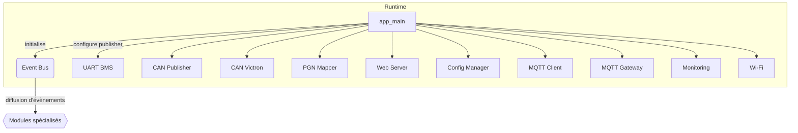

# Module `app_main`

## Références
- `main/app_main.c`
- `main/include/app_config.h`
- `main/include/app_events.h`

## Diagramme UML

## Rôle et responsabilités
`app_main` constitue le point d'entrée de l'application ESP-IDF. Il assemble les différents modules fonctionnels du portail TinyBMS et établit les flux de communication inter-modules via le bus d'évènements. Sa responsabilité principale est de garantir que chaque sous-système est initialisé dans un ordre cohérent, avec ses dépendances satisfaites, et qu'il dispose d'un crochet de publication pour informer le reste du système.

## Séquence d'initialisation
1. **Initialisation du bus d'évènements** : `event_bus_init()` prépare l'infrastructure de publication/abonnement. Le pointeur de fonction retourné par `event_bus_get_publish_hook()` est considéré comme l'API canonique de publication pour tout le projet.
2. **Injection des crochets de publication** : Chaque module possédant une API `*_set_event_publisher()` reçoit immédiatement le crochet. Cela garantit que toute notification générée dès l'initialisation pourra être relayée.
3. **Initialisation des services d'arrière-plan** : Les modules sont initialisés dans un ordre qui respecte leurs dépendances implicites :
   - `config_manager_init()` charge la configuration persistante (NVS) avant que d'autres services ne la consomment.
   - `wifi_init()` configure la connectivité, nécessaire au client MQTT et au serveur HTTP pour exposer leurs services.
   - `uart_bms_init()` et `can_victron_init()` activent les interfaces matérielles de télémétrie.
   - `can_publisher_init()` relie les trames calculées par `can_victron_publish_frame()` au bus CAN.
   - `pgn_mapper_init()`, `web_server_init()`, `mqtt_client_init()`, `mqtt_gateway_init()` et `monitoring_init()` démarrent les services d'application reposant sur les flux de données précédents.
4. **Boucle principale** : Une tâche vide avec temporisation de 1 seconde maintient le thread principal en vie. Toute la logique métier s'exécute dans les tâches des modules spécialisés.

## Interactions inter-modules
- **Bus d'évènements** : `app_main` ne publie pas directement, mais il garantit que tous les modules partagent la même fonction de publication. Les identifiants d'évènements sont définis dans `app_events.h`.
- **Dépendances circulaires évitées** : En passant les crochets au lieu d'objets concrets, le couplage entre modules reste faible.
- **MQTT** : `mqtt_client_init()` reçoit le listener fourni par `mqtt_gateway_get_event_listener()`, créant un lien bidirectionnel (le client diffuse les évènements réseau, la passerelle décide des publications MQTT).
- **CAN** : `can_publisher_init()` reçoit à la fois le crochet d'évènements et le callback bas-niveau `can_victron_publish_frame` pour transmettre physiquement les trames.

## Considérations de configuration
- Les constantes globales (identifiant de l'appareil, topics MQTT par défaut, etc.) sont centralisées dans `app_config.h` et `mqtt_topics.h`. Les modules chargés d'appliquer la configuration (configuration MQTT ou périodicité de scrutation) la lisent après leur initialisation.
- L'ordre d'initialisation peut être ajusté si un nouveau service dépend d'un module existant. Toujours injecter le crochet d'évènements avant `*_init()`.

## Extensibilité
Pour ajouter un nouveau module :
1. Exposer `*_set_event_publisher()` pour s'aligner avec le paradigme événementiel.
2. Exposer `*_init()` et le faire appeler depuis `app_main` après ses dépendances directes.
3. Ajouter les nouvelles définitions d'évènements dans `app_events.h` au besoin.

## Diagnostic et arrêt
`app_main` ne réalise pas l'arrêt ni la désinitialisation. Les suites de tests peuvent cependant invoquer `event_bus_deinit()` ou les `*_deinit()` spécifiques si nécessaires. Toute logique de redémarrage contrôlé doit s'exécuter dans les modules eux-mêmes.
