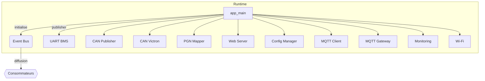

# Module `app_main`

## Références
- `main/app_main.c`
- `main/include/app_config.h`
- `main/include/app_events.h`

## Diagramme UML

## Rôle et responsabilités
`app_main` constitue le point d'entrée ESP-IDF. Il assemble tous les sous-systèmes TinyBMS, injecte le crochet de publication du bus d’évènements et déclenche les initialisations dans un ordre cohérent. Une fois la phase de bootstrap terminée, la boucle principale se contente d’un `vTaskDelay(1000 ms)` : toute la logique métier vit dans les tâches des modules spécialisés.【F:main/app_main.c†L1-L44】

## Paramètres globaux
- **Identité firmware** : `APP_DEVICE_NAME = "TinyBMS-WebGateway"`, version `0.1.0` via `APP_VERSION_{MAJOR,MINOR,PATCH}`. Ces constantes sont utilisées pour former les topics MQTT par défaut et l’ID exposé dans les API REST.【F:main/include/app_config.h†L1-L8】【F:main/config_manager/config_manager.c†L136-L168】
- **Catalogue d’évènements** : `app_events.h` énumère toutes les familles (`APP_EVENT_ID_TELEMETRY_SAMPLE`, `APP_EVENT_ID_CAN_FRAME_READY`, etc.) garantissant une coordination cohérente entre producteurs et consommateurs.【F:main/include/app_events.h†L12-L43】

## Graphe d'initialisation détaillé
| Ordre | Fonction | Rôle principal | Dépendances requises | Notifications clés |
| --- | --- | --- | --- | --- |
| 1 | `event_bus_init()` | Crée le mutex et la liste d’abonnés | Aucune | — |
| 2 | `*_set_event_publisher()` (UART, CAN, MQTT, Wi-Fi, Web…) | Injecte le `event_bus_publish_fn_t` | Bus initialisé | Tous les modules peuvent publier dès l’init | 
| 3 | `config_manager_init()` | Charge NVS, topics MQTT, intervalle de poll | Bus prêt (pour notifier) | `APP_EVENT_ID_CONFIG_UPDATED` (si nécessaire) |
| 4 | `wifi_init()` | Démarre la pile station/AP | Config (SSID) | `APP_EVENT_ID_WIFI_*` |
| 5 | `uart_bms_init()` | Active l’UART TinyBMS et la tâche de polling | Config (intervalle) | `APP_EVENT_ID_BMS_LIVE_DATA`, `APP_EVENT_ID_UART_FRAME_*` |
| 6 | `can_victron_init()` | Configure TWAI + keepalive Victron | — | `APP_EVENT_ID_CAN_FRAME_{RAW,DECODED}` |
| 7 | `can_publisher_init(publish_hook, can_victron_publish_frame)` | Convertit la télémétrie en PGN Victron et publie sur CAN | UART (données), CAN Victron (TX) | `APP_EVENT_ID_CAN_FRAME_READY` |
| 8 | `pgn_mapper_init()` | Met en cache les dernières données TinyBMS pour usage futur | UART | (aucun évènement émis pour l’instant) |
| 9 | `web_server_init()` | Monte SPIFFS, expose REST + WebSocket | Config, Monitoring | Diffuse `APP_EVENT_ID_UI_NOTIFICATION`, etc. via bus |
| 10 | `mqtt_client_init(mqtt_gateway_get_event_listener())` | Prépare le client MQTT ESP-IDF avec listener de la passerelle | Wi-Fi (connectivité), Config MQTT | Propagation d’évènements `MQTT_CLIENT_EVENT_*` |
| 11 | `mqtt_gateway_init()` | Souscrit au bus, mappe topics, orchestre (re)connexion MQTT | MQTT client, Wi-Fi, Config | Publie `status`, `metrics`, `can_*` |
| 12 | `monitoring_init()` | S’abonne à `uart_bms` et publie snapshots JSON | UART, Event bus | `APP_EVENT_ID_TELEMETRY_SAMPLE` |

La boucle finale `while(true) { vTaskDelay(1000); }` maintient le thread principal vivant sans monopoliser le CPU.【F:main/app_main.c†L38-L44】

## Interactions inter-modules
- **Bus d’évènements partagé** : l’unique `event_bus_publish_fn_t` est passé à tous les modules, garantissant que leurs évènements transitent par le même mécanisme (queues FreeRTOS + callbacks).【F:main/app_main.c†L9-L31】【F:main/event_bus/event_bus.c†L1-L154】
- **Chaînage MQTT** : `mqtt_client_init()` reçoit le listener fourni par `mqtt_gateway_get_event_listener()`, permettant à la passerelle d’intercepter les évènements `MQTT_CLIENT_EVENT_*` et de piloter la (re)connexion ou la publication de diagnostics.【F:main/app_main.c†L25-L37】【F:main/mqtt_gateway/mqtt_gateway.c†L73-L206】
- **CAN** : `can_publisher_init()` est initialisé après `can_victron_init()` afin de disposer du callback `can_victron_publish_frame`. Les trames prêtes sont publiées sur le bus (`APP_EVENT_ID_CAN_FRAME_READY`) puis envoyées physiquement via TWAI.【F:main/app_main.c†L24-L37】【F:main/can_publisher/can_publisher.c†L87-L205】

## Considérations de configuration
- Les modules consomment les paramètres persistés (`config_manager`) dès leur init : poll interval UART, identifiants MQTT, topics personnalisés, etc.【F:main/config_manager/config_manager.c†L300-L379】【F:main/uart_bms/uart_bms.cpp†L188-L245】
- Toute nouvelle brique doit déclarer un `*_set_event_publisher()` et idéalement un `*_init()` idempotent pour s’intégrer au flux sans perturber la configuration existante.

## Extensibilité et tests
- Pour ajouter un module, suivre la table d’ordre d’initialisation : injecter le publisher, initialiser après les dépendances et, si besoin, publier un évènement de disponibilité.
- Les tests unitaires peuvent invoquer `event_bus_deinit()` et les `*_deinit()` spécifiques si un démontage propre est requis ; `app_main` n’effectue pas de shutdown explicite.
