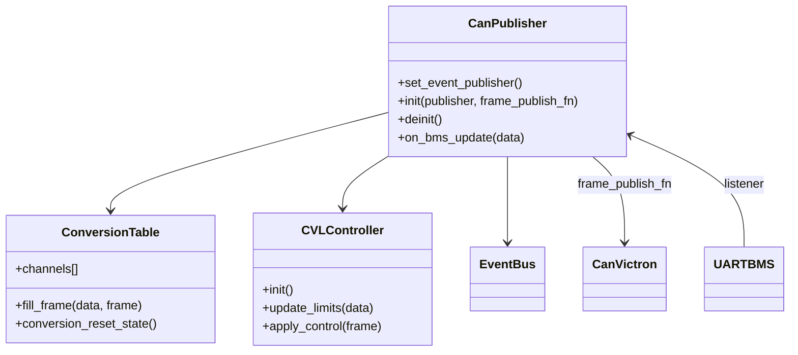

# Module `can_publisher`

## Références
- `main/can_publisher/can_publisher.h`
- `main/can_publisher/can_publisher.c`
- `main/can_publisher/conversion_table.h`
- `main/can_publisher/conversion_table.c`
- `main/can_publisher/cvl_controller.h`
- `main/can_publisher/cvl_controller.c`
- `main/can_publisher/cvl_logic.h`
- `main/can_publisher/cvl_logic.c`
- `main/can_publisher/cvl_types.h`
- `main/include/app_events.h`
- `main/uart_bms/uart_bms.h`

## Diagramme UML

## Rôle et responsabilités
`can_publisher` traduit la télémétrie TinyBMS en trames CAN compatibles Victron (PGN 0x35x/0x37x) : chaque mise à jour TinyBMS déclenche la génération d’un ensemble de frames, leur publication immédiate ou planifiée sur le bus CAN (`can_victron_publish_frame`) ainsi que la diffusion d’évènements `APP_EVENT_ID_CAN_FRAME_READY` pour les consommateurs secondaires (MQTT, WebSocket).【F:main/can_publisher/can_publisher.c†L87-L205】【F:main/include/app_events.h†L34-L43】

## Paramètres de configuration
- **Cadence de publication** : `CONFIG_TINYBMS_CAN_PUBLISHER_PERIOD_MS` (défaut 0) force un envoi périodique commun ; sinon chaque canal applique sa période intrinsèque. Les délais sont convertis en ticks via `can_publisher_ms_to_ticks()` (minimum 1 tick).【F:main/can_publisher/can_publisher.c†L24-L120】
- **Taille de buffer** : `CAN_PUBLISHER_MAX_BUFFER_SLOTS` (défini dans `can_publisher.h`) limite simultanément le nombre de PGN suivis ; le module tronque `g_can_publisher_channels` si nécessaire et dimensionne `s_event_frames`/`s_frame_buffer` en conséquence.【F:main/can_publisher/can_publisher.c†L104-L155】
- **Timeouts** : `CAN_PUBLISHER_EVENT_TIMEOUT_MS = 50` ms pour publier sur le bus d’évènements, `CAN_PUBLISHER_LOCK_TIMEOUT_MS = 20` ms pour les accès mutex. Ces paramètres bornent la latence vers MQTT et la webapp.【F:main/can_publisher/can_publisher.c†L20-L54】
- **Identité Victron** : chaînes configurables via `CONFIG_TINYBMS_CAN_MANUFACTURER`, `CONFIG_TINYBMS_CAN_BATTERY_NAME`, `CONFIG_TINYBMS_CAN_BATTERY_FAMILY` avec valeurs par défaut `"TinyBMS"`, `"Lithium Battery"`. Elles alimentent les PGN 0x35E/0x35F/0x382. Priorité CAN = 6, adresse source = 0xE5, ce qui produit des identifiants étendus `0x18 0x0PGN 0xE5`.【F:main/can_publisher/conversion_table.c†L15-L58】

## PGN et trames CAN Victron
La table `g_can_publisher_channels` décrit exhaustivement les trames envoyées : PGN, identifiant CAN étendu, longueur, période et fonction de remplissage à partir de `uart_bms_live_data_t`.

| PGN | CAN ID | DLC | Période (ms) | Fonction de remplissage | Description |
| --- | --- | --- | --- | --- | --- |
| 0x351 | 0x180351E5 | 8 | 1000 | `encode_charge_limits` | Victron charge/discharge limits |
| 0x355 | 0x180355E5 | 8 | 1000 | `encode_soc_soh` | Victron SOC/SOH |
| 0x356 | 0x180356E5 | 8 | 1000 | `encode_voltage_current_temperature` | Victron voltage/current/temperature |
| 0x35A | 0x18035AE5 | 8 | 1000 | `encode_alarm_status` | Victron alarm summary |
| 0x35E | 0x18035EE5 | 8 | 2000 | `encode_manufacturer_string` | Victron manufacturer string |
| 0x35F | 0x18035FE5 | 8 | 2000 | `encode_battery_name` | Victron battery info |
| 0x371 | 0x180371E5 | 8 | 2000 | `encode_battery_name_part2` | Victron battery info part 2 |
| 0x378 | 0x180378E5 | 8 | 1000 | `encode_energy_counters` | Victron energy counters |
| 0x379 | 0x180379E5 | 8 | 5000 | `encode_installed_capacity` | Victron installed capacity |
| 0x382 | 0x180382E5 | 8 | 5000 | `encode_battery_family` | Victron battery family |

## Détails des encodeurs PGN
- **0x351 – Charge/Discharge Limits** : encode CVL (×10 V), CCL/DCL (×10 A) selon la logique DVCC (`can_publisher_cvl_get_latest`). En absence de contrôle DVCC, derive les limites depuis les registres TinyBMS (overvoltage cutoff, surintensités, courant de pointe).【F:main/can_publisher/conversion_table.c†L332-L379】
- **0x355 – State of Charge/Health** : encode SoC et SoH en 0.1 % (×10) avec saturation à 0…1000.【F:main/can_publisher/conversion_table.c†L381-L404】
- **0x356 – Voltage/Current/Temperature** : tension pack (×100 V), courant signé (×10 A) et température MOSFET (×10 °C).【F:main/can_publisher/conversion_table.c†L406-L437】
- **0x35A – Alarm Status** : couvre la matrice complète Victron : alarmes (octets 0–3) et avertissements (octets 4–7) encodés sur 2 bits (0 = OK, 1 = warning, 2 = alarm, 3 = réservé). Les seuils s’appuient sur `*_cutoff`, les limites de courant TinyBMS et la température externe `auxiliary_temperature_c`, avec hystérésis (±5 % ou +5 °C) pour les avertissements. Les bits réservés sont forcés à `0b11` et le récapitulatif global passe par `General Alarm/Warning` (byte 0 bit0-1 / byte 4 bit0-1).【F:main/can_publisher/conversion_table.c†L115-L206】【F:main/can_publisher/conversion_table.c†L434-L547】
- **0x35E/0x35F/0x371/0x382 – Chaînes ASCII** : extraient les textes TinyBMS (registres 0x01F4–0x01F6) via `decode_ascii_from_registers`; sinon retombent sur les constantes `CONFIG_TINYBMS_CAN_*`. Le second bloc du nom batterie commence à l’octet 8 pour couvrir 16 caractères.【F:main/can_publisher/conversion_table.c†L519-L626】
- **0x378 – Compteurs d’énergie** : accumule Wh chargés/déchargés (`s_energy_charged_wh`, `s_energy_discharged_wh`) basés sur l’intégration courants/temps, encode deux compteurs 32 bits little-endian.【F:main/can_publisher/conversion_table.c†L140-L228】【F:main/can_publisher/conversion_table.c†L628-L654】
- **0x379 – Capacité installée** : convertit `battery_capacity_ah`, applique SoH si disponible, retombe sur estimation `series_cell_count × 2.5 Ah` en absence de valeur, encode en Ah (×1).【F:main/can_publisher/conversion_table.c†L656-L686】

## Gestion des limites CVL
- `cvl_controller` et `cvl_logic` calculent CVL/CCL/DCL en fonction des alarmes TinyBMS, de la température et des overrides Victron. Les résultats sont consultés par `encode_charge_limits` et publiés en logs en cas d’invalidation.【F:main/can_publisher/cvl_controller.c†L37-L247】【F:main/can_publisher/conversion_table.c†L332-L368】
- `can_publisher_cvl_prepare()` est appelé à chaque frame TinyBMS pour rafraîchir l’état (hystérésis, timestamps).【F:main/can_publisher/cvl_controller.c†L249-L376】【F:main/can_publisher/can_publisher.c†L177-L217】

## Flux d'exécution
1. **Initialisation** : `can_publisher_init()` enregistre le publisher d’évènements, configure le tableau des canaux, crée les mutex/tâches, s’abonne au module `uart_bms` et planifie les deadlines de chaque PGN.【F:main/can_publisher/can_publisher.c†L87-L205】
2. **Réception TinyBMS** : `can_publisher_on_bms_update()` remplit chaque `can_publisher_frame_t`, met à jour le buffer circulaire et déclenche soit l’envoi immédiat soit l’enregistrement pour la tâche périodique.【F:main/can_publisher/can_publisher.c†L207-L303】
3. **Tâche périodique** (`can_publisher_task`) : évalue la prochaine échéance, envoie via `can_victron_publish_frame`, republie l’évènement et reprogramme la deadline.【F:main/can_publisher/can_publisher.c†L305-L404】

## Gestion des buffers
- `can_publisher_store_frame()` assure l’unicité par canal et protège l’accès via `s_buffer_mutex` (`CAN_PUBLISHER_LOCK_TIMEOUT_MS`).【F:main/can_publisher/can_publisher.c†L217-L303】
- `s_event_frames` constitue un miroir stable pour les évènements (`APP_EVENT_ID_CAN_FRAME_READY`) afin d’éviter les données volatiles lors de la diffusion MQTT/WebSocket.【F:main/can_publisher/can_publisher.c†L104-L155】

## Publication d'évènements et intégrations
- Chaque frame CAN générée publie `APP_EVENT_ID_CAN_FRAME_READY` contenant `can_publisher_frame_t` (ID, DLC, payload, timestamp) ; `mqtt_gateway` transforme ces notifications en JSON `can_ready` et `web_server` les diffuse via WebSocket CAN.【F:main/can_publisher/can_publisher.c†L130-L205】【F:main/mqtt_gateway/mqtt_gateway.c†L200-L254】【F:main/web_server/web_server.c†L970-L1058】
- `APP_EVENT_ID_CAN_FRAME_RAW/DECODED` restent du ressort de `can_victron` (RX) ; `can_publisher` produit uniquement la variante `READY` (TX).【F:main/include/app_events.h†L34-L43】

## Diagnostics et extensibilité
- Logs `"can_pub"` signalent les cadences configurées, les échecs d’envoi CAN et les troncatures de canal.【F:main/can_publisher/can_publisher.c†L122-L205】
- `can_publisher_conversion_reset_state()` remet à zéro les compteurs Wh lorsque nécessaire (ex. reset SoC).【F:main/can_publisher/conversion_table.c†L103-L132】
- Pour ajouter un PGN : implémenter une fonction `encode_*`, l’enregistrer dans `g_can_publisher_channels`, ajuster les buffers/tâches si la capacité augmente, puis fournir une description fonctionnelle pour la documentation Victron (`docs/reference/victron_pgn_signal_summary.md`).【F:main/can_publisher/conversion_table.c†L612-L711】

## Interaction avec d'autres modules
- `can_victron` assure la transmission physique et le keepalive Victron.
- `mqtt_gateway` et `web_server` consomment `APP_EVENT_ID_CAN_FRAME_READY` pour alimenter les topics `bms/<id>/can/ready` et les WebSockets CAN.
- `monitoring` peut exposer les limites CVL résultantes dans `/api/status` via la télémétrie TinyBMS synchronisée.
`can_publisher` est la brique responsable de la traduction des données TinyBMS en trames CAN compatibles Victron (PGN 0x35x, 0x37x, etc.). Il écoute les mises à jour `uart_bms`, prépare les frames correspondantes, les publie sur le bus CAN via `can_victron_publish_frame()` et diffuse aussi les trames prêtes sur le bus d'évènements (`APP_EVENT_ID_CAN_FRAME_READY`).

## Catalogue de canaux
- La table statique `g_can_publisher_channels` (dans `conversion_table.c`) décrit chaque PGN : identifiant CAN étendu (`VICTRON_EXTENDED_ID`), DLC, période individuelle et fonction `fill_fn`.
- Les fonctions de conversion encodent les valeurs physiques TinyBMS (voltage, courant, SoC, températures, alarmes...) vers les formats Victron, avec saturation (`clamp_u16`, `encode_i16_scaled`, etc.) et gestion d'énergie cumulée (`s_energy_charged_wh`, `s_energy_discharged_wh`).
- `conversion_table.h` expose l'API de remplissage et le nombre de canaux.

## Gestion des limites CVL
- `cvl_controller` et `cvl_logic` gèrent la compatibilité Victron DVCC (Charge Voltage Limit / Discharge Current Limit). Ils calculent dynamiquement les limites (DCL, CCL) en fonction des alarmes et des registres TinyBMS, et injectent ces valeurs dans les trames PGN 0x351.
- Le module conserve l'état interne (historiques d'énergie, limites, timers) pour produire des valeurs continues cohérentes.

## Flux d'exécution
1. `can_publisher_init()` :
   - Enregistre les canaux, calcule la capacité de buffer (`CAN_PUBLISHER_MAX_BUFFER_SLOTS`).
   - Initialise la logique CVL via `can_publisher_cvl_init()`.
   - Crée un mutex (`s_buffer_mutex`) et s'abonne aux mises à jour TinyBMS (`uart_bms_register_listener`).
   - Installe éventuellement une tâche périodique (si `CONFIG_TINYBMS_CAN_PUBLISHER_PERIOD_MS` > 0) chargée d'émettre les trames selon des deadlines (`s_channel_deadlines`).

2. **Réception TinyBMS** : `can_publisher_on_bms_update()` (callback) :
   - Met à jour les limites CVL.
   - Pour chaque canal, appelle `fill_fn` pour produire un `can_publisher_frame_t`.
   - Stocke la frame dans `s_frame_buffer` (protégé par mutex) et publie un évènement `APP_EVENT_ID_CAN_FRAME_READY` (copie dans `s_event_frames`).
   - Si le mode périodique est désactivé, transmet immédiatement via `s_frame_publisher` (typiquement `can_victron_publish_frame`).

3. **Tâche de publication** (`can_publisher_task`) :
   - Réveille selon la deadline la plus proche.
   - Appelle `can_publisher_publish_buffer()` pour émettre toutes les trames arrivées à échéance.
   - Reprogramme les deadlines en fonction de la période de chaque canal.

## Gestion des buffers
- `can_publisher_store_frame()` assure que chaque slot correspond à un canal unique.
- `s_event_frames` constitue un second buffer circulaire pour les évènements bus (payload stable).
- Les conversions utilisent `s_event_lock` (spinlock) pour protéger l'indice circulaire.

## Publication d'évènements
- `APP_EVENT_ID_CAN_FRAME_READY` contient `can_publisher_frame_t` (ID, DLC, payload, timestamp). Ces évènements alimentent `mqtt_gateway` et `web_server`.

## Diagnostics
- Les logs (`TAG = "can_pub"`) indiquent l'initialisation, les erreurs de publication CAN et les délais d'émission.
- Les conversions loggent en niveau `DEBUG`/`WARN` lorsque des valeurs dépassent les limites Victron.

## Extensibilité
- Pour ajouter un nouveau PGN :
  1. Définir la fonction `fill_fn` dans `conversion_table.c`.
  2. L'ajouter dans `g_can_publisher_channels` avec la période désirée.
  3. Ajuster `CAN_PUBLISHER_MAX_BUFFER_SLOTS` si nécessaire.
- Pour intégrer d'autres algorithmes de limitation (ex. température), étendre `cvl_logic.c`.

## Interaction avec d'autres modules
- `can_victron` assure la transmission physique.
- `mqtt_gateway` consomme `APP_EVENT_ID_CAN_FRAME_READY` pour publier sur `MQTT_TOPIC_FMT_CAN_STREAM`.
- `monitoring` peut utiliser les trames prêtes pour exposer l'état Victron dans `/api/status`.
