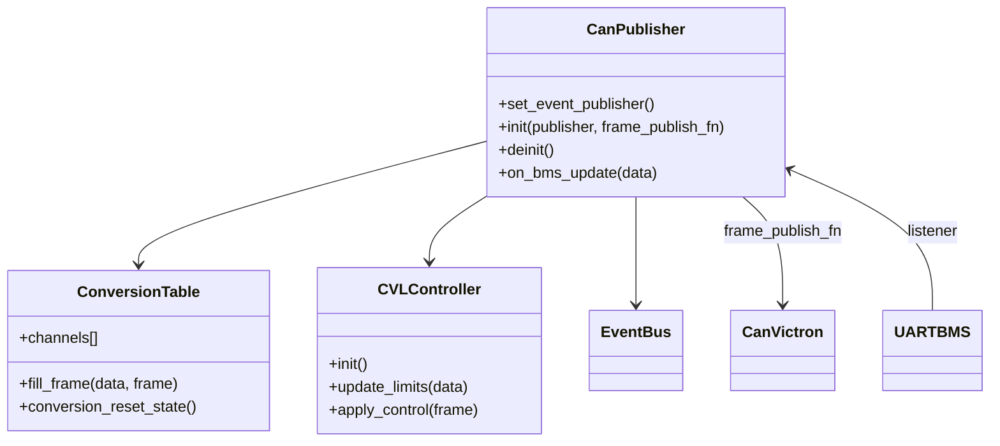

# Module `can_publisher`

## Références
- `main/can_publisher/can_publisher.h`
- `main/can_publisher/can_publisher.c`
- `main/can_publisher/conversion_table.h`
- `main/can_publisher/conversion_table.c`
- `main/can_publisher/cvl_controller.h`
- `main/can_publisher/cvl_controller.c`
- `main/can_publisher/cvl_logic.h`
- `main/can_publisher/cvl_logic.c`
- `main/can_publisher/cvl_types.h`
- `main/include/app_events.h`
- `main/uart_bms/uart_bms.h`

## Diagramme UML

## Rôle et responsabilités
`can_publisher` est la brique responsable de la traduction des données TinyBMS en trames CAN compatibles Victron (PGN 0x35x, 0x37x, etc.). Il écoute les mises à jour `uart_bms`, prépare les frames correspondantes, les publie sur le bus CAN via `can_victron_publish_frame()` et diffuse aussi les trames prêtes sur le bus d'évènements (`APP_EVENT_ID_CAN_FRAME_READY`).

## Catalogue de canaux
- La table statique `g_can_publisher_channels` (dans `conversion_table.c`) décrit chaque PGN : identifiant CAN étendu (`VICTRON_EXTENDED_ID`), DLC, période individuelle et fonction `fill_fn`.
- Les fonctions de conversion encodent les valeurs physiques TinyBMS (voltage, courant, SoC, températures, alarmes...) vers les formats Victron, avec saturation (`clamp_u16`, `encode_i16_scaled`, etc.) et gestion d'énergie cumulée (`s_energy_charged_wh`, `s_energy_discharged_wh`).
- `conversion_table.h` expose l'API de remplissage et le nombre de canaux.

## Gestion des limites CVL
- `cvl_controller` et `cvl_logic` gèrent la compatibilité Victron DVCC (Charge Voltage Limit / Discharge Current Limit). Ils calculent dynamiquement les limites (DCL, CCL) en fonction des alarmes et des registres TinyBMS, et injectent ces valeurs dans les trames PGN 0x351.
- Le module conserve l'état interne (historiques d'énergie, limites, timers) pour produire des valeurs continues cohérentes.

## Flux d'exécution
1. `can_publisher_init()` :
   - Enregistre les canaux, calcule la capacité de buffer (`CAN_PUBLISHER_MAX_BUFFER_SLOTS`).
   - Initialise la logique CVL via `can_publisher_cvl_init()`.
   - Crée un mutex (`s_buffer_mutex`) et s'abonne aux mises à jour TinyBMS (`uart_bms_register_listener`).
   - Installe éventuellement une tâche périodique (si `CONFIG_TINYBMS_CAN_PUBLISHER_PERIOD_MS` > 0) chargée d'émettre les trames selon des deadlines (`s_channel_deadlines`).

2. **Réception TinyBMS** : `can_publisher_on_bms_update()` (callback) :
   - Met à jour les limites CVL.
   - Pour chaque canal, appelle `fill_fn` pour produire un `can_publisher_frame_t`.
   - Stocke la frame dans `s_frame_buffer` (protégé par mutex) et publie un évènement `APP_EVENT_ID_CAN_FRAME_READY` (copie dans `s_event_frames`).
   - Si le mode périodique est désactivé, transmet immédiatement via `s_frame_publisher` (typiquement `can_victron_publish_frame`).

3. **Tâche de publication** (`can_publisher_task`) :
   - Réveille selon la deadline la plus proche.
   - Appelle `can_publisher_publish_buffer()` pour émettre toutes les trames arrivées à échéance.
   - Reprogramme les deadlines en fonction de la période de chaque canal.

## Gestion des buffers
- `can_publisher_store_frame()` assure que chaque slot correspond à un canal unique.
- `s_event_frames` constitue un second buffer circulaire pour les évènements bus (payload stable).
- Les conversions utilisent `s_event_lock` (spinlock) pour protéger l'indice circulaire.

## Publication d'évènements
- `APP_EVENT_ID_CAN_FRAME_READY` contient `can_publisher_frame_t` (ID, DLC, payload, timestamp). Ces évènements alimentent `mqtt_gateway` et `web_server`.

## Diagnostics
- Les logs (`TAG = "can_pub"`) indiquent l'initialisation, les erreurs de publication CAN et les délais d'émission.
- Les conversions loggent en niveau `DEBUG`/`WARN` lorsque des valeurs dépassent les limites Victron.

## Extensibilité
- Pour ajouter un nouveau PGN :
  1. Définir la fonction `fill_fn` dans `conversion_table.c`.
  2. L'ajouter dans `g_can_publisher_channels` avec la période désirée.
  3. Ajuster `CAN_PUBLISHER_MAX_BUFFER_SLOTS` si nécessaire.
- Pour intégrer d'autres algorithmes de limitation (ex. température), étendre `cvl_logic.c`.

## Interaction avec d'autres modules
- `can_victron` assure la transmission physique.
- `mqtt_gateway` consomme `APP_EVENT_ID_CAN_FRAME_READY` pour publier sur `MQTT_TOPIC_FMT_CAN_STREAM`.
- `monitoring` peut utiliser les trames prêtes pour exposer l'état Victron dans `/api/status`.
