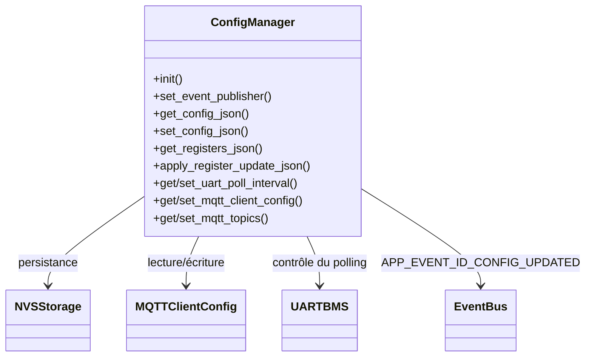

# Module `config_manager`

## Références
- `main/config_manager/config_manager.h`
- `main/config_manager/config_manager.c`
- `main/config_manager/generated_tiny_rw_registers.inc`
- `main/include/app_config.h`
- `main/include/app_events.h`
- `main/mqtt_client/mqtt_client.h`
- `main/mqtt_client/mqtt_topics.h`

## Diagramme UML

## Rôle et responsabilités
`config_manager` centralise la configuration persistante du portail TinyBMS : paramètres MQTT, intervalle de scrutation UART, mapping des registres modifiables et topics MQTT. Il fournit une API JSON consommée par le serveur HTTP et par l'interface utilisateur, et se charge d'appliquer les modifications côté système, y compris l'émission d'évènements pour notifier les autres modules.

## Fonctions exposées
- **Initialisation** : `config_manager_init()` charge les données persistées depuis NVS (si disponible) et construit les valeurs par défaut via `config_manager_reset_mqtt_topics()` et les macros `CONFIG_TINYBMS_*` de `sdkconfig`/`app_config.h`.
- **Publication d'évènements** : `config_manager_set_event_publisher()` injecte le crochet utilisé pour émettre `APP_EVENT_ID_CONFIG_UPDATED` après une mise à jour réussie.
- **Gestion JSON** :
  - `config_manager_get_config_json()` sérialise la configuration générale (MQTT, Wi-Fi, intervalle de scrutation) dans un tampon fourni.
  - `config_manager_set_config_json()` valide et persiste un document JSON reçu (REST). Elle applique les changements au runtime et persiste en NVS.
  - `config_manager_get_registers_json()` expose la liste des registres modifiables via les descripteurs générés dans `generated_tiny_rw_registers.inc` (accès, échelles, labels, etc.).
  - `config_manager_apply_register_update_json()` traite une requête ciblant un registre TinyBMS, en prépare l'écriture UART puis vérifie le read-back.
- **Paramètres UART** : `config_manager_get_uart_poll_interval_ms()` et `config_manager_set_uart_poll_interval_ms()` s'assurent que l'intervalle reste dans la fenêtre `[UART_BMS_MIN_POLL_INTERVAL_MS, UART_BMS_MAX_POLL_INTERVAL_MS]` et synchronisent `uart_bms_set_poll_interval_ms()`.
- **Configuration MQTT** : `config_manager_get_mqtt_client_config()`/`config_manager_set_mqtt_client_config()` manipulent la structure `mqtt_client_config_t`, avec sanitation (keepalive, QoS) et détection d'identifiants vides.
- **Topics MQTT** : `config_manager_get_mqtt_topics()`/`config_manager_set_mqtt_topics()` gèrent les chaînes dynamiques utilisées par `mqtt_gateway`.

## Persistance (NVS)
- Les clés sont stockées dans l'espace de noms `gateway_cfg`. Exemple : `mqtt_uri`, `mqtt_keepalive`, `mqtt_t_met`.
- Lors de l'initialisation, l'absence d'une clé déclenche la restauration de la valeur par défaut (définie via macros `CONFIG_TINYBMS_*`).
- Chaque écriture JSON valide est persistée : `config_manager_set_config_json()` ouvre NVS, stocke les chaînes/entiers, puis commite.

## Interaction avec les autres modules
- **UART BMS** : Lors d'une mise à jour de registre (`config_manager_apply_register_update_json()`), le module invoque `uart_bms_write_register()` et republie la télémétrie. Le polling peut être ajusté dynamiquement.
- **MQTT** : Après mise à jour de la configuration MQTT, `config_manager` stocke `mqtt_client_config_t`. `mqtt_gateway` inspecte ensuite `config_manager_get_mqtt_client_config()` pour redémarrer la connexion si nécessaire.
- **Web server** : Les handlers REST `/api/config` et `/api/registers` s'appuient directement sur les fonctions JSON du module.
- **Event bus** : `APP_EVENT_ID_CONFIG_UPDATED` permet aux frontends (WebSocket, MQTT) de notifier l'utilisateur qu'une configuration a changé.

## Validation et sanitation
- Les chaînes sont copiées via `config_manager_copy_string()` afin d'éviter les dépassements et d'assurer la terminaison NUL.
- Les URIs MQTT sont analysées avec `config_manager_parse_mqtt_uri()` pour séparer schéma, hôte et port; les ports par défaut (1883 / 8883) sont appliqués selon le schéma.
- Les topics MQTT sont nettoyés (`config_manager_sanitise_mqtt_topics()`) pour garantir des chaînes valides.
- Les mises à jour de registres TinyBMS utilisent des descriptions pré-générées décrivant les min/max, échelles, étapes et enums autorisés.

## Publication d'évènements
Lorsque la configuration évolue (JSON général ou registres), le module construit un payload JSON succinct contenant la catégorie de changement et le publie via `event_bus_publish_fn_t`. Les consommateurs (UI, MQTT) peuvent ainsi rafraîchir leur état.

## Diagnostics
- Les logs (tag `config_manager`) utilisent différents niveaux (`ESP_LOGI/W/E`) pour les opérations NVS et les conversions JSON.
- Des limites statiques (`CONFIG_MANAGER_MAX_CONFIG_SIZE`, `CONFIG_MANAGER_MAX_REGISTERS_JSON`) protègent les buffers.

## Extension
Pour ajouter un nouveau paramètre persisté :
1. Définir des macros de configuration par défaut dans `sdkconfig` ou `app_config.h`.
2. Ajouter des champs dans les structures correspondantes (`mqtt_client_config_t`, `config_manager_mqtt_topics_t`, etc.).
3. Étendre les fonctions JSON et le schéma NVS avec de nouvelles clés.
4. Documenter la signification dans cette référence et dans la documentation REST.
