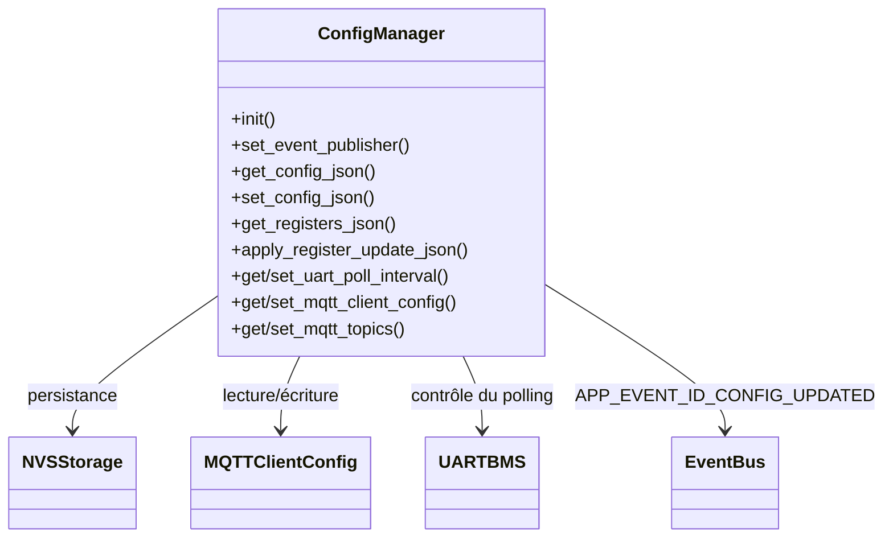

# Module `config_manager`

## Références
- `main/config_manager/config_manager.h`
- `main/config_manager/config_manager.c`
- `main/config_manager/generated_tiny_rw_registers.inc`
- `docs/tiny_rw_bms.json`
- `main/include/app_config.h`
- `main/include/app_events.h`
- `main/mqtt_client/mqtt_client.h`
- `main/mqtt_client/mqtt_topics.h`

## Diagramme UML

## Rôle et responsabilités
`config_manager` centralise la configuration persistante du portail TinyBMS : paramètres MQTT, intervalle de scrutation UART, mapping des registres modifiables et topics MQTT. Il fournit une API JSON consommée par le serveur HTTP, applique les changements côté système et publie `APP_EVENT_ID_CONFIG_UPDATED` pour notifier les autres modules.【F:main/config_manager/config_manager.c†L33-L210】【F:main/include/app_events.h†L16-L24】

## Paramètres de persistance (NVS)
- **Espace de noms** : `gateway_cfg` (`CONFIG_MANAGER_NAMESPACE`). Toutes les clés sont stockées dans cette partition.【F:main/config_manager/config_manager.c†L23-L48】
- **Clés principales** :

| Clé NVS | Description | Valeur par défaut | Macro associée |
| --- | --- | --- | --- |
| `uart_poll` | Intervalle de polling UART TinyBMS (ms) | `UART_BMS_DEFAULT_POLL_INTERVAL_MS = 250` | `CONFIG_MANAGER_POLL_KEY` + `UART_BMS_*`【F:main/config_manager/config_manager.c†L23-L72】【F:main/uart_bms/uart_bms.h†L13-L19】
| `mqtt_uri` | URI du broker MQTT | `CONFIG_TINYBMS_MQTT_BROKER_URI` (défaut `mqtt://localhost`) | `CONFIG_MANAGER_MQTT_URI_KEY`【F:main/config_manager/config_manager.c†L35-L84】
| `mqtt_user` | Nom d’utilisateur MQTT | `CONFIG_TINYBMS_MQTT_USERNAME` (chaîne vide par défaut) | `CONFIG_MANAGER_MQTT_USERNAME_KEY`【F:main/config_manager/config_manager.c†L35-L84】
| `mqtt_pass` | Mot de passe MQTT | `CONFIG_TINYBMS_MQTT_PASSWORD` | `CONFIG_MANAGER_MQTT_PASSWORD_KEY`【F:main/config_manager/config_manager.c†L35-L84】
| `mqtt_keepalive` | Keepalive MQTT (s) | `CONFIG_TINYBMS_MQTT_KEEPALIVE` (60 par défaut) | `CONFIG_MANAGER_MQTT_KEEPALIVE_KEY`【F:main/config_manager/config_manager.c†L35-L92】
| `mqtt_qos` | QoS par défaut | `CONFIG_TINYBMS_MQTT_DEFAULT_QOS` (1) | `CONFIG_MANAGER_MQTT_QOS_KEY`【F:main/config_manager/config_manager.c†L35-L92】
| `mqtt_retain` | Flag retain pour status | `CONFIG_TINYBMS_MQTT_RETAIN_STATUS` (0 ⇒ false) | `CONFIG_MANAGER_MQTT_RETAIN_KEY`【F:main/config_manager/config_manager.c†L35-L99】
| `mqtt_t_stat` | Topic statut | `bms/<APP_DEVICE_NAME>/status` | `CONFIG_MANAGER_MQTT_TOPIC_STATUS_KEY` + `MQTT_TOPIC_FMT_STATUS`【F:main/config_manager/config_manager.c†L36-L142】【F:main/mqtt_client/mqtt_topics.h†L12-L26】
| `mqtt_t_met` | Topic métriques | `bms/<APP_DEVICE_NAME>/metrics` | `CONFIG_MANAGER_MQTT_TOPIC_MET_KEY`【F:main/config_manager/config_manager.c†L36-L142】
| `mqtt_t_cfg` | Topic config | `bms/<APP_DEVICE_NAME>/config` | `CONFIG_MANAGER_MQTT_TOPIC_CFG_KEY`【F:main/config_manager/config_manager.c†L36-L142】
| `mqtt_t_crw` | Topic CAN brut | `bms/<APP_DEVICE_NAME>/can/raw` | `CONFIG_MANAGER_MQTT_TOPIC_RAW_KEY`【F:main/config_manager/config_manager.c†L36-L142】
| `mqtt_t_cdc` | Topic CAN décodé | `bms/<APP_DEVICE_NAME>/can/decoded` | `CONFIG_MANAGER_MQTT_TOPIC_DEC_KEY`【F:main/config_manager/config_manager.c†L36-L142】
| `mqtt_t_crd` | Topic CAN prêt (TX) | `bms/<APP_DEVICE_NAME>/can/ready` | `CONFIG_MANAGER_MQTT_TOPIC_RDY_KEY`【F:main/config_manager/config_manager.c†L36-L142】
| `regXXXX` | Valeur brute d’un registre TinyBMS (adresse hex.) | N/A (voir table ci-dessous) | `CONFIG_MANAGER_REGISTER_KEY_PREFIX`【F:main/config_manager/config_manager.c†L23-L48】

Les fonctions `config_manager_load_*`/`save_*` valident chaque champ (longueur des chaînes, plage QoS, booléens) avant persistance.【F:main/config_manager/config_manager.c†L380-L612】

## Topics MQTT gérés
- `config_manager_reset_mqtt_topics()` renseigne les valeurs par défaut à partir de `MQTT_TOPIC_FMT_*` et de `APP_DEVICE_NAME`. Les topics utilisateur sont persistés dans NVS et copiés via `config_manager_copy_topics()`.【F:main/config_manager/config_manager.c†L136-L168】
- Les attributs `status`, `metrics`, `config`, `can_raw`, `can_decoded`, `can_ready` forment la structure `config_manager_mqtt_topics_t` consommée par `mqtt_gateway` pour choisir le topic effectif.【F:main/config_manager/config_manager.c†L104-L175】【F:main/mqtt_gateway/mqtt_gateway.c†L134-L206】

| Champ | Description | QoS recommandé | Retain recommandé |
| --- | --- | --- | --- |
| `status` | Snapshot JSON `monitoring` (type `battery`) | `MQTT_TOPIC_STATUS_QOS = 1` | `MQTT_TOPIC_STATUS_RETAIN = true`【F:main/mqtt_client/mqtt_topics.h†L12-L26】
| `metrics` | Flux temps réel (non retenu) | `MQTT_TOPIC_METRICS_QOS = 0` | `MQTT_TOPIC_METRICS_RETAIN = false`【F:main/mqtt_client/mqtt_topics.h†L14-L20】
| `config` | Accusés de réception config | `MQTT_TOPIC_CONFIG_QOS = 1` | `MQTT_TOPIC_CONFIG_RETAIN = false`【F:main/mqtt_client/mqtt_topics.h†L21-L26】
| `can_raw` | Trames CAN RX/TX hexadécimales | `MQTT_TOPIC_CAN_QOS = 0` | `MQTT_TOPIC_CAN_RETAIN = false`【F:main/mqtt_client/mqtt_topics.h†L16-L24】
| `can_decoded` | Trames CAN enrichies (victron) | `MQTT_TOPIC_CAN_QOS = 0` | `MQTT_TOPIC_CAN_RETAIN = false`【F:main/mqtt_client/mqtt_topics.h†L16-L24】
| `can_ready` | Trames CAN préparées par `can_publisher` | `MQTT_TOPIC_CAN_QOS = 0` | `MQTT_TOPIC_CAN_RETAIN = false`【F:main/mqtt_client/mqtt_topics.h†L16-L24】

## Registres TinyBMS configurables
Les registres modifiables sont décrits par `generated_tiny_rw_registers.inc` (généré depuis `docs/tiny_rw_bms.json`). Chaque entrée précise le groupe fonctionnel, l’échelle numérique, les bornes, le pas de saisie et les éventuelles énumérations. Les écritures utilisent `uart_bms_write_register()` avec read-back automatique.【F:main/config_manager/config_manager.c†L454-L612】【F:main/uart_bms/uart_bms.cpp†L705-L789】

| Adresse | Clé JSON | Libellé | Groupe | Unité | Type | Accès | Échelle | Précision | Min | Max | Pas | Défaut | Enumérations | Commentaire |
| --- | --- | --- | --- | --- | --- | --- | --- | --- | --- | --- | --- | --- | --- | --- |
| 0x012C | `fully_charged_voltage_mv` | Fully Charged Voltage | battery | mV | uint16 | rw | 1.0 | 0 | 1200 | 4500 | 10 | 3650 | - | Cell voltage when considered fully charged |
| 0x012D | `fully_discharged_voltage_mv` | Fully Discharged Voltage | battery | mV | uint16 | rw | 1.0 | 0 | 1000 | 3500 | 10 | 3250 | - | Cell voltage considered fully discharged |
| 0x012F | `early_balancing_threshold_mv` | Early Balancing Threshold | battery | mV | uint16 | rw | 1.0 | 0 | 1000 | 4500 | 10 | 3400 | - | Cell voltage threshold that enables balancing |
| 0x0130 | `charge_finished_current_ma` | Charge Finished Current | battery | mA | uint16 | rw | 1.0 | 0 | 100 | 5000 | 10 | 1000 | - | Current threshold signalling charge completion |
| 0x0131 | `peak_discharge_current_a` | Peak Discharge Current Cutoff | battery | A | uint16 | rw | 1.0 | 0 | 1 | 750 | 1 | 70 | - | Instantaneous discharge protection limit |
| 0x0132 | `battery_capacity_ah` | Battery Capacity | battery | Ah | uint16 | rw | 0.01 | 2 | 10 | 65500 | 1 | 31400 | - | Pack capacity used for SOC calculations |
| 0x0133 | `cell_count` | Number of Series Cells | battery | cells | enum | rw | 1.0 | 0 | 4 | 16 | 1 | 16 | 4:4 cells, 5:5 cells, 6:6 cells, 7:7 cells, 8:8 cells, 9:9 cells, 10:10 cells, 11:11 cells, 12:12 cells, 13:13 cells, 14:14 cells, 15:15 cells, 16:16 cells | Configured number of series-connected cells |
| 0x0134 | `allowed_disbalance_mv` | Allowed Cell Disbalance | battery | mV | uint16 | rw | 1.0 | 0 | 15 | 100 | 1 | 15 | - | Maximum per-cell delta before alarms |
| 0x0136 | `charger_startup_delay_s` | Charger Startup Delay | charger | s | uint16 | rw | 1.0 | 0 | 5 | 60 | 1 | 20 | - | Delay before enabling the charger |
| 0x0137 | `charger_disable_delay_s` | Charger Disable Delay | charger | s | uint16 | rw | 1.0 | 0 | 0 | 60 | 1 | 5 | - | Delay before disabling charger after fault |
| 0x013B | `overvoltage_cutoff_mv` | Over-voltage Cutoff | safety | mV | uint16 | rw | 1.0 | 0 | 1200 | 4500 | 10 | 3800 | - | Cell voltage threshold to stop charging |
| 0x013C | `undervoltage_cutoff_mv` | Under-voltage Cutoff | safety | mV | uint16 | rw | 1.0 | 0 | 800 | 3500 | 10 | 2800 | - | Cell voltage threshold to stop discharging |
| 0x013D | `discharge_overcurrent_a` | Discharge Over-current Cutoff | safety | A | uint16 | rw | 1.0 | 0 | 1 | 750 | 1 | 65 | - | Current limit for discharge protection |
| 0x013E | `charge_overcurrent_a` | Charge Over-current Cutoff | safety | A | uint16 | rw | 1.0 | 0 | 1 | 750 | 1 | 90 | - | Current limit for charge protection |
| 0x013F | `overheat_cutoff_c` | Overheat Cutoff | safety | °C | uint16 | rw | 1.0 | 0 | 20 | 90 | 1 | 60 | - | Temperature threshold to stop charging/discharging |
| 0x0140 | `low_temp_charge_cutoff_c` | Low Temperature Charge Cutoff | safety | °C | int16 | rw | 1.0 | 0 | -40 | 10 | 1 | 0 | - | Temperature below which charging is disabled |
| 0x0141 | `charge_restart_level_percent` | Charge Restart Level | advanced | % | uint16 | rw | 1.0 | 0 | 60 | 95 | 1 | 80 | - | SOC threshold to re-enable charging |
| 0x0142 | `battery_max_cycles` | Battery Maximum Cycles Count | advanced | cycles | uint16 | rw | 1.0 | 0 | 10 | 65000 | 10 | 5000 | - | Total cycle counter limit |
| 0x0143 | `state_of_health_permille` | State Of Health | advanced | ‰ | uint16 | rw | 0.01 | 2 | 0 | 50000 | 1 | 100 | - | Settable SOH value |
| 0x0148 | `state_of_charge_permille` | State Of Charge | advanced | ‰ | uint16 | rw | 0.01 | 2 | 0 | 50000 | 1 | 40 | - | Manual SOC override |
| 0x0149 | `invert_ext_current_sensor` | Invert External Current Sensor | advanced | flag | enum | rw | 1.0 | 0 | - | - | - | 0 | 0:Normal, 1:Invert | Invert external shunt polarity |
| 0x014A | `charger_type` | Charger Type | system | mode | enum | rw | 1.0 | 0 | - | - | - | 1 | 0:Variable (Reserved), 1:Constant Current | Defines charger behavior |
| 0x014B | `load_switch_type` | Load Switch Type | system | mode | enum | rw | 1.0 | 0 | - | - | - | 0 | 0:FET, 1:AIDO1, 2:AIDO2, 3:DIDO1, 4:DIDO2, 5:AIHO1 Active Low, 6:AIHO1 Active High, 7:AIHO2 Active Low, 8:AIHO2 Active High | Output used for load switching |
| 0x014C | `automatic_recovery_count` | Automatic Recovery Attempts | system | count | uint16 | rw | 1.0 | 0 | 1 | 30 | 1 | 5 | - | Number of automatic recovery tries |
| 0x014D | `charger_switch_type` | Charger Switch Type | system | mode | enum | rw | 1.0 | 0 | - | - | - | 1 | 1:Charge FET, 2:AIDO1, 3:AIDO2, 4:DIDO1, 5:DIDO2, 6:AIHO1 Active Low, 7:AIHO1 Active High, 8:AIHO2 Active Low, 9:AIHO2 Active High | Output controlling the charger |
| 0x014E | `ignition_source` | Ignition Source | system | mode | enum | rw | 1.0 | 0 | - | - | - | 0 | 0:Disabled, 1:AIDO1, 2:AIDO2, 3:DIDO1, 4:DIDO2, 5:AIHO1, 6:AIHO2 | Input used to sense ignition |
| 0x014F | `charger_detection_source` | Charger Detection Source | system | mode | enum | rw | 1.0 | 0 | - | - | - | 1 | 1:Internal, 2:AIDO1, 3:AIDO2, 4:DIDO1, 5:DIDO2, 6:AIHO1, 7:AIHO2 | Source used to detect presence of charger |
| 0x0151 | `precharge_pin` | Precharge Output | system | mode | enum | rw | 1.0 | 0 | - | - | - | 0 | 0:Disabled, 2:Discharge FET, 3:AIDO1, 4:AIDO2, 5:DIDO1, 6:DIDO2, 7:AIHO1 Active Low, 8:AIHO1 Active High, 9:AIHO2 Active Low, 16:AIHO2 Active High | Output used to precharge the contactor |
| 0x0152 | `precharge_duration` | Precharge Duration | system | s | enum | rw | 1.0 | 1 | - | - | - | 7 | 0:0.1 s, 1:0.2 s, 2:0.5 s, 3:1 s, 4:2 s, 5:3 s, 6:4 s, 7:5 s | Duration of precharge before closing main contactor |
| 0x0153 | `temperature_sensor_type` | Temperature Sensor Type | system | mode | enum | rw | 1.0 | 0 | - | - | - | 0 | 0:Dual 10K NTC, 1:Multipoint Active Sensor | Defines type of connected temp sensors |
| 0x0154 | `operation_mode` | BMS Operation Mode | system | mode | enum | rw | 1.0 | 0 | - | - | - | 0 | 0:Dual Port, 1:Single Port | Dual or single port operation |
| 0x0155 | `single_port_switch_type` | Single Port Switch Type | system | mode | enum | rw | 1.0 | 0 | - | - | - | 0 | 0:FET, 1:AIDO1, 2:AIDO2, 3:DIDO1, 4:DIDO2, 5:AIHO1 Active Low, 6:AIHO1 Active High, 7:AIHO2 Active Low, 8:AIHO2 Active High | Output used when operating in single-port mode |
| 0x0156 | `broadcast_interval` | Broadcast Interval | system | mode | enum | rw | 1.0 | 0 | - | - | - | 0 | 0:Disabled, 1:0.1 s, 2:0.2 s, 3:0.5 s, 4:1 s, 5:2 s, 6:5 s, 7:10 s | UART broadcast period |
| 0x0157 | `communication_protocol` | Communication Protocol | system | mode | enum | rw | 1.0 | 0 | - | - | - | 1 | 0:Binary, 1:ASCII | Protocol used on UART port |

## Fonctions exposées
- `config_manager_init()` : charge le namespace NVS, restaure les topics MQTT, applique la configuration MQTT aux structures en mémoire et installe les valeurs par défaut si aucune donnée n’est présente.【F:main/config_manager/config_manager.c†L300-L379】
- `config_manager_set_config_json()` : parse un document JSON, valide chaque champ, met à jour NVS, ajuste le polling UART via `uart_bms_set_poll_interval_ms()` et publie `APP_EVENT_ID_CONFIG_UPDATED` avec un résumé JSON (`{"type":"config"}`).【F:main/config_manager/config_manager.c†L381-L612】
- `config_manager_apply_register_update_json()` : identifie l’adresse (`reg`), vérifie l’appartenance à la table RW, construit la valeur brute en respectant échelle/pas/enum, appelle `uart_bms_write_register()` et persiste le read-back dans NVS (`reg%04X`).【F:main/config_manager/config_manager.c†L454-L612】
- `config_manager_get_registers_json()` : sérialise la table ci-dessus (informations d’échelle, min/max, type, enum) pour l’UI et l’API REST.【F:main/config_manager/config_manager.c†L210-L298】

## Interaction avec les autres modules
- **UART BMS** : ajuste `uart_bms_set_poll_interval_ms()` et commande `uart_bms_write_register()` pour appliquer les nouvelles valeurs TinyBMS.【F:main/config_manager/config_manager.c†L492-L612】
- **MQTT Gateway** : fournit `mqtt_client_config_t` et les topics ; une mise à jour déclenche `mqtt_gateway_reload_config(true)` via l’évènement `APP_EVENT_ID_CONFIG_UPDATED`.【F:main/mqtt_gateway/mqtt_gateway.c†L168-L254】
- **Web server** : les endpoints `/api/config`, `/api/registers`, `/api/mqtt/config` s’appuient sur les fonctions JSON exposées par le module.【F:main/web_server/web_server.c†L980-L1260】

## Validation et sanitation
- `config_manager_copy_string()` et `config_manager_copy_topics()` garantissent la terminaison NUL et la copie sécurisée dans les buffers statiques.【F:main/config_manager/config_manager.c†L100-L168】
- `config_manager_parse_mqtt_uri()` normalise schéma/port, refuse les URI trop longues (`MQTT_CLIENT_MAX_URI_LENGTH = 128`).【F:main/config_manager/config_manager.c†L210-L378】【F:main/mqtt_client/mqtt_client.h†L24-L46】
- Les valeurs numériques sont clampées contre les bornes définies dans `docs/tiny_rw_bms.json` avant écriture, assurant une cohérence avec le firmware TinyBMS.【F:main/config_manager/config_manager.c†L454-L612】

## Publication d'évènements et diagnostics
- Les changements de configuration publient `APP_EVENT_ID_CONFIG_UPDATED` avec un JSON `{ "type": "config", ... }` ; les mises à jour de registres utilisent `{ "type": "register", "address": 0xNNNN }`. Les consommateurs (websocket, MQTT) peuvent ainsi rafraîchir leur état.【F:main/config_manager/config_manager.c†L552-L612】
- Les logs `config_manager` tracent les lectures/écritures NVS et les erreurs de parsing JSON, facilitant le diagnostic sur console série.【F:main/config_manager/config_manager.c†L300-L612】

## Extension
Pour ajouter un nouveau paramètre persisté :
1. Définir les macros par défaut dans `sdkconfig`/`app_config.h` et, si nécessaire, un champ JSON/REST.
2. Ajouter les clés NVS correspondantes (`CONFIG_MANAGER_*_KEY`) et étendre les structures (`mqtt_client_config_t`, `config_manager_mqtt_topics_t`, etc.).
3. Mettre à jour `tiny_rw_bms.json` pour générer automatiquement la table des registres.
4. Étendre cette documentation (table NVS + table de registres) afin de conserver une référence exhaustive.
