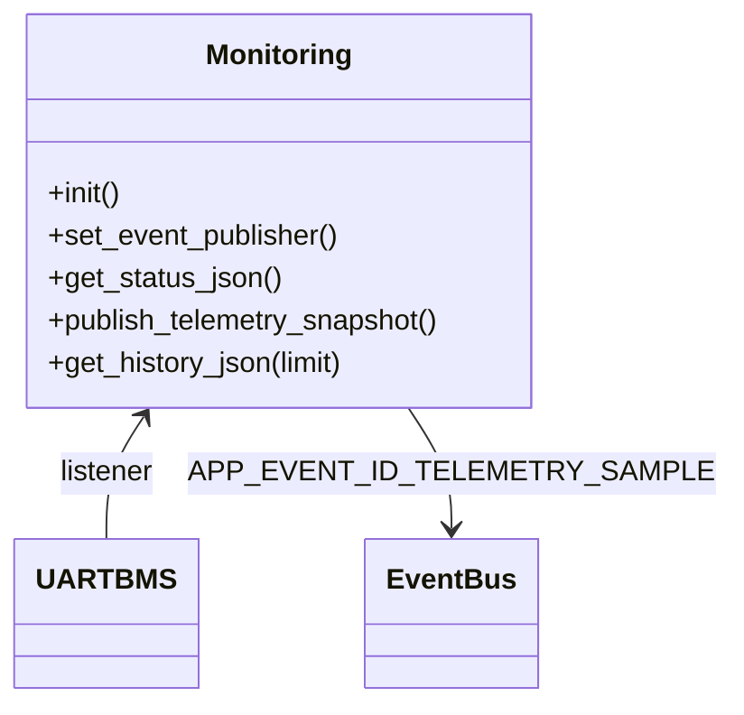

# Module `monitoring`

## Références
- `main/monitoring/monitoring.h`
- `main/monitoring/monitoring.c`
- `main/include/app_events.h`
- `main/uart_bms/uart_bms.h`

## Diagramme UML

## Rôle et responsabilités
`monitoring` agrège les mesures TinyBMS, génère des snapshots JSON et conserve un historique circulaire pour la consultation via l'API REST. Il publie également des évènements `APP_EVENT_ID_TELEMETRY_SAMPLE` destinés au MQTT et aux WebSockets.

## Fonctionnement
- **Abonnement TinyBMS** : `monitoring_init()` s'inscrit auprès de `uart_bms`. À chaque mise à jour, le callback `monitoring_on_bms_update()` :
  - met à jour la copie `s_latest_bms` ;
  - pousse un échantillon dans l'historique (`s_history`, capacité 512) ;
  - appelle `monitoring_publish_telemetry_snapshot()`.
- **Historique** : stocke les champs essentiels (timestamp, voltage, courant, SoC, SoH, température moyenne) pour optimiser la taille mémoire.
- **Snapshots JSON** : `monitoring_build_snapshot_json()` génère un document contenant : mesures temps réel, registres (liste d'adresses/valeurs), bits d'alarme/équilibrage, disponibilité de l'historique.
- **Publication** : `monitoring_publish_telemetry_snapshot()` publie un évènement `APP_EVENT_ID_TELEMETRY_SAMPLE` dont le payload est le buffer JSON `s_last_snapshot`.

## API exposée
- `monitoring_get_status_json()` : renvoie l'état courant (snapshot dernier connu). Utilisé par `/api/status`.
- `monitoring_publish_telemetry_snapshot()` : force une republication (ex : sur requête API).
- `monitoring_get_history_json(limit, ...)` : sérialise l'historique (limité par `limit` ou la capacité) sous forme de tableau JSON.

## Gestion des buffers
- Les JSON sont construits dans des buffers statiques (`s_last_snapshot[1024]`). Le module vérifie systématiquement que les écritures n'excèdent pas la taille disponible.
- Les évènements n'incluent pas de copies additionnelles, mais réutilisent le buffer tant que le consumer le traite rapidement. Les publications sont protégées via `event_bus_publish_fn_t` avec timeout 50 ms.

## Intégration
- `mqtt_gateway` publie les snapshots sur le topic `metrics`.
- `web_server` s'appuie sur `monitoring_get_status_json()` et `monitoring_get_history_json()` pour répondre aux requêtes HTTP.

## Extensibilité
- Ajouter de nouveaux champs JSON en complétant `monitoring_build_snapshot_json()` (penser à ajuster la taille du buffer).
- Étendre `monitoring_history_entry_t` si des données supplémentaires doivent être historisées (attention à la RAM).
- Introduire des statistiques dérivées (moyenne glissante, max/min) pour l'UI.
