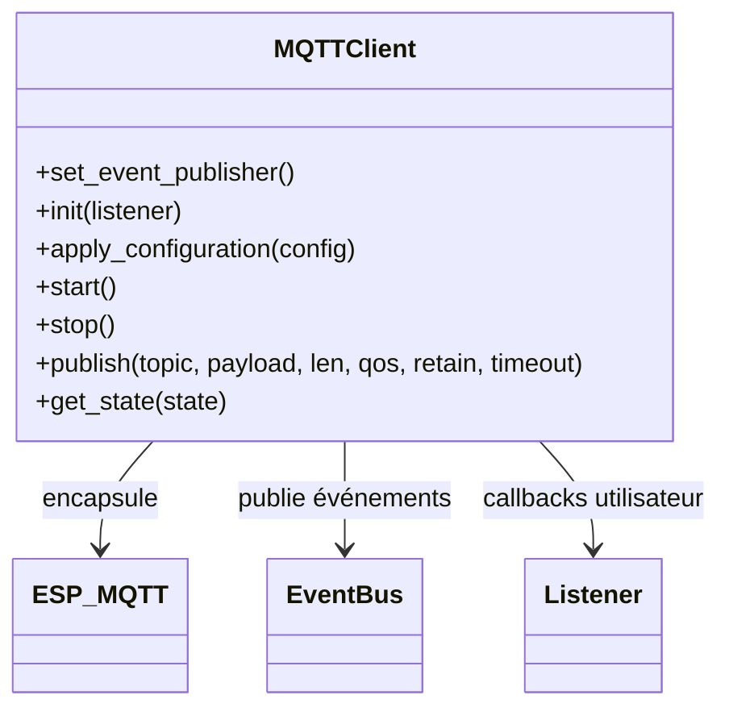

# Module `mqtt_client`

## Références
- `main/mqtt_client/mqtt_client.h`
- `main/mqtt_client/mqtt_client.c`
- `main/mqtt_client/mqtt_topics.h`
- `main/include/app_events.h`

## Diagramme UML

## Rôle et responsabilités
Le module `mqtt_client` est un wrapper thread-safe autour de l'ESP-IDF `esp_mqtt_client`. Il encapsule la configuration, gère les callbacks d'évènements, expose un état interne pour les diagnostics et fournit une API de publication synchronisée pour les autres modules (`mqtt_gateway`, `config_manager`).

## Cycle de vie
1. `mqtt_client_set_event_publisher()` : enregistre le bus d'évènements pour relayer les changements d'état (`APP_EVENT_ID_UI_NOTIFICATION`, etc.).
2. `mqtt_client_init(listener)` :
   - Crée un mutex interne.
   - Sauvegarde le listener optionnel (`mqtt_client_event_listener_t`).
   - Crée un handle `esp_mqtt_client_handle_t` sur ESP-IDF.
   - Met l'état interne `initialised = true`.
3. `mqtt_client_apply_configuration(config)` : copie la configuration (`broker_uri`, `credentials`, `keepalive`, `QoS`, `retain`) dans le handle ESP-IDF et met à jour l'état.
4. `mqtt_client_start()` : démarre la machine d'état (connect). Le module met `started = true` si succès.
5. `mqtt_client_stop()` : stoppe la connexion, libère le handle et remet les flags à zéro.

## Gestion des évènements
- Lorsqu'ESP-IDF appelle le callback `mqtt_event_handler`, le module :
  - normalise l'évènement en `mqtt_client_event_t` (ID + payload générique).
  - Notifie l'éventuel listener (`mqtt_gateway`).
  - Publie un `event_bus_event_t` pour les consommateurs (UI, logs).
- Les IDs couvrent `CONNECTED`, `DISCONNECTED`, `SUBSCRIBED`, `PUBLISHED`, `DATA`, `ERROR`.

## Publication
`mqtt_client_publish()` :
- Prend le mutex pour garantir l'exclusivité.
- Vérifie que la connexion est active (`state.started`).
- Appelle `esp_mqtt_client_publish()` avec QoS et `retain` fournis.
- Attend la complétion via `TickType_t timeout` ; si l'opération échoue, renvoie `false`.

## État & diagnostics
- `mqtt_client_state_t` expose :
  - création du mutex (`lock_created`), initialisation, démarrage, enregistrement du listener et du publisher.
  - `client_handle_created` pour vérifier l'existence d'un handle valide.
- Utilisé par les tests unitaires pour vérifier les transitions.

## Intégration
- `config_manager` fournit la configuration via `mqtt_client_config_t`.
- `mqtt_gateway` agit comme listener pour orchestrer les publications et la reconnexion.
- Les évènements bus sont consommés par le `web_server` pour mettre à jour `/api/mqtt`.

## Extensibilité
- Pour supporter TLS mutualisé ou certificats personnalisés, étendre `mqtt_client_apply_configuration()` pour renseigner les champs `cert_pem`/`client_cert`.
- Pour ajouter de nouvelles métriques, enrichir `mqtt_client_state_t` et les publications d'évènements.
