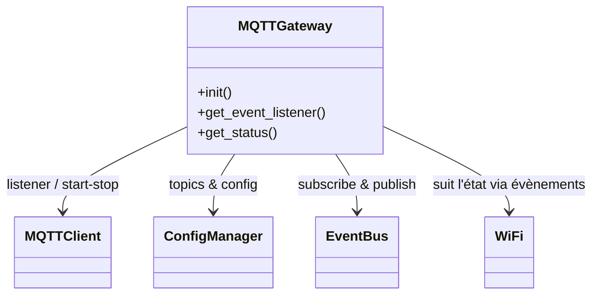

# Module `mqtt_gateway`

## Références
- `main/mqtt_gateway/mqtt_gateway.h`
- `main/mqtt_gateway/mqtt_gateway.c`
- `main/mqtt_client/mqtt_client.h`
- `main/config_manager/config_manager.h`
- `main/include/app_events.h`
- `main/mqtt_client/mqtt_topics.h`

## Diagramme UML

## Rôle et responsabilités
`mqtt_gateway` connecte la télémétrie TinyBMS au broker MQTT :
- gère la connexion MQTT (démarrage/arrêt) selon la configuration et l'état Wi-Fi ;
- traduit les évènements applicatifs (`APP_EVENT_ID_*`) en publications MQTT ;
- maintient un état interne (`mqtt_gateway_status_t`) exposé via l'API web.

## Initialisation
- `mqtt_gateway_init()` :
  - Initialise le contexte (`s_gateway`) : mutex, topics par défaut, compteurs.
  - Abonne `s_gateway.subscription` au bus d'évènements (file dédiée).
  - Démarre la tâche `mqtt_gateway_task` qui traite en continu les évènements reçus.
  - Charge les topics depuis `config_manager_get_mqtt_topics()` et la configuration `mqtt_client_config_t`.
  - Enregistre `s_mqtt_listener` via `mqtt_gateway_get_event_listener()` auprès du module `mqtt_client`.

## Gestion des évènements MQTT
- `mqtt_gateway_on_mqtt_event()` reçoit les `mqtt_client_event_t` et :
  - met à jour l'état (`connected`, `last_event`, `last_event_timestamp_us`);
  - en cas d'erreur, incrémente `error_count` et retient le dernier message (`last_error`).
- Au `CONNECTED`, le module publie un message de statut initial (JSON) sur le topic status.
- Les évènements `DISCONNECTED` déclenchent des tentatives de reconnexion différées selon le nombre d'échecs.

## Publication de données TinyBMS
- La tâche principale consomme les évènements bus et route selon l'ID :
  - `APP_EVENT_ID_TELEMETRY_SAMPLE` -> topic `metrics` (JSON) ;
  - `APP_EVENT_ID_CAN_FRAME_READY` -> topic `can_ready` (binaire encodé) ;
  - `APP_EVENT_ID_CAN_FRAME_RAW/DECODED` -> topics `can_raw` / `can_decoded` ;
  - `APP_EVENT_ID_CONFIG_UPDATED` -> topic `config` ;
  - `APP_EVENT_ID_UI_NOTIFICATION` -> topic `status` (avec `retain` configurable).
- Les publications utilisent `mqtt_client_publish()` avec QoS par défaut (`config.default_qos`).

## Synchronisation Wi-Fi
- Les évènements `APP_EVENT_ID_WIFI_STA_CONNECTED/GOT_IP` mettent `wifi_connected=true` et peuvent déclencher un démarrage du client MQTT si `mqtt_started==false`.
- Les évènements `APP_EVENT_ID_WIFI_STA_DISCONNECTED` stoppent temporairement le client et arment un retry.

## Configuration dynamique
- `mqtt_gateway_load_topics()` et `mqtt_gateway_set_topic()` récupèrent les topics depuis `config_manager`. Un changement de configuration (évènement `APP_EVENT_ID_CONFIG_UPDATED`) peut entraîner la reconstruction des topics et rediffusion du statut.
- `mqtt_gateway_get_status()` copie l'état courant (topics, compteurs, dernier évènement) pour exposition via `/api/mqtt` ou WebSocket.

## Tâches et verrous
- `s_gateway.lock` (mutex) protège l'état partagé.
- La tâche `mqtt_gateway_task` gère la logique de reconnexion (délai, incrémentation `reconnect_count`).
- Les opérations de publication prennent le mutex le temps de copier la configuration.

## Extensibilité
- Pour ajouter un nouveau flux MQTT, gérer l'ID d'évènement correspondant dans la tâche et prévoir un topic (configurable via `config_manager`).
- Pour supporter l'abonnement à des topics entrants, enrichir `mqtt_gateway_on_mqtt_event()` pour traiter `MQTT_CLIENT_EVENT_DATA` et publier l'évènement sur le bus.
