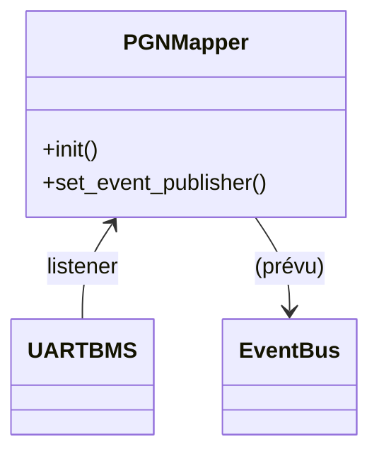

# Module `pgn_mapper`

## Références
- `main/pgn_mapper/pgn_mapper.h`
- `main/pgn_mapper/pgn_mapper.c`
- `main/uart_bms/uart_bms.h`
- `main/include/app_events.h`

## Diagramme UML

## Rôle et état actuel
`pgn_mapper` est prévu pour traduire les données TinyBMS vers des messages CAN Victron complexes ou pour enrichir les notifications applicatives. Actuellement, le module se contente d'écouter les mises à jour TinyBMS via `uart_bms_register_listener()` et de mémoriser la dernière structure `uart_bms_live_data_t`. Aucun évènement n'est encore publié, mais les logs indiquent la réception des données (`ESP_LOGD`).

## Responsabilités planifiées
- Maintenir un cache des dernières valeurs TinyBMS afin de calculer des trames PGN dérivées (par exemple `0x351` pour DVCC) ou des dérivés statistiques.
- Fournir un point de collecte pour convertir les données en format Victron standard, potentiellement en collaboration avec `can_publisher`.
- Publier des évènements sur `APP_EVENT_ID_CAN_FRAME_DECODED` ou d'autres topics lorsqu'une traduction est disponible.

## Extension recommandée
Pour achever le module :
1. Implémenter des fonctions de conversion (similaires à celles de `conversion_table.c`).
2. Publier les trames calculées via `event_bus_event_t` (payload structuré ou JSON).
3. Synchroniser les périodes de publication avec `can_publisher` afin d'éviter des doublons.
4. Ajouter des tests unitaires couvrant la transformation TinyBMS -> PGN.
