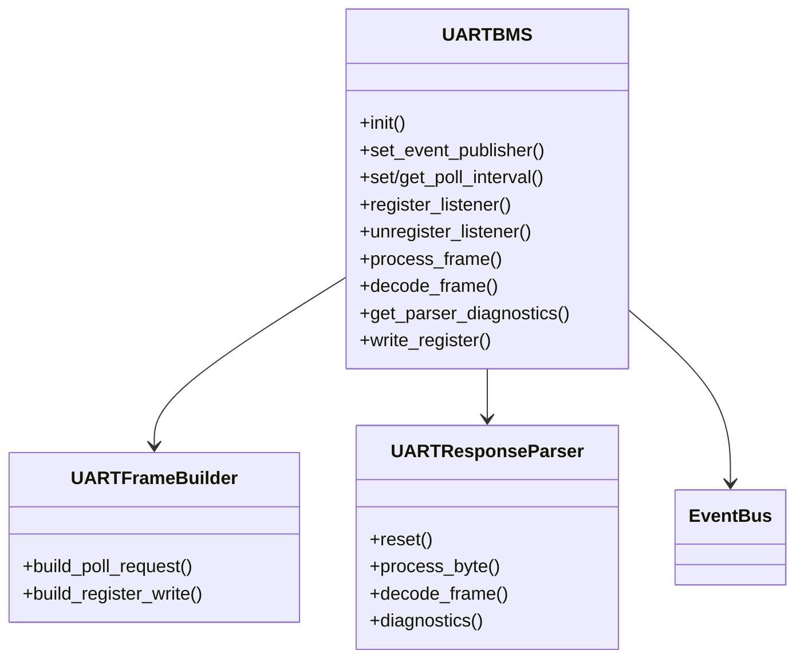

# Module `uart_bms`

## Références
- `main/uart_bms/uart_bms.h`
- `main/uart_bms/uart_bms.cpp`
- `main/uart_bms/uart_bms_protocol.h`
- `main/uart_bms/uart_bms_protocol.c`
- `main/uart_bms/uart_frame_builder.h`
- `main/uart_bms/uart_frame_builder.cpp`
- `main/uart_bms/uart_response_parser.h`
- `main/uart_bms/uart_response_parser.cpp`
- `main/include/app_events.h`

## Diagramme UML

## Rôle et responsabilités
Le module `uart_bms` pilote la communication UART avec le TinyBMS : émission périodique de requêtes, réception/décodage des trames, diffusion des échantillons et gestion des écritures de registres. Il fournit également une API d'abonnement pour les autres modules (C et C++), et publie différents évènements (`APP_EVENT_ID_BMS_LIVE_DATA`, `APP_EVENT_ID_UART_FRAME_RAW`, `APP_EVENT_ID_UART_FRAME_DECODED`).

## Architecture
- **Tâche de polling** : une tâche FreeRTOS (`UART_BMS_TASK_PRIORITY=12`) envoie la requête poll (`uart_frame_builder_build_poll_request`) à intervalle configurable et attend la réponse via `uart_read_bytes`.
- **Parser incrémental** : `UartResponseParser` traite les octets reçus, vérifie l'en-tête, la longueur et le CRC, puis construit un `uart_bms_live_data_t` complet.
- **Bufferisation** : les structures circulaires `s_event_buffers` et `s_uart_raw_json/s_uart_decoded_json` évitent de publier des pointeurs volatils. Chaque évènement contient une copie stable des données.
- **Listeners** : deux registres parallèles de 4 slots chacun : callbacks C (`uart_bms_register_listener`) et callbacks C++ (`uart_bms_register_shared_listener`) consommant la structure `TinyBMS_LiveData` partagée (`shared_data.h`).

## API principale
- `uart_bms_init()` : configure l'UART (pins, vitesse, buffers), installe la tâche de polling, prépare la requête standard TinyBMS, initialise le parser et le mutex de commande.
- `uart_bms_set_event_publisher()` : reçoit la fonction de publication du bus.
- `uart_bms_set_poll_interval_ms()` : ajuste l'intervalle en respectant `[UART_BMS_MIN_POLL_INTERVAL_MS, UART_BMS_MAX_POLL_INTERVAL_MS]` avec verrou `s_poll_interval_lock`.
- `uart_bms_register_listener()` / `uart_bms_unregister_listener()` : enregistrent/désenregistrent un callback de haut niveau.
- `uart_bms_process_frame()` / `uart_bms_decode_frame()` : exposent la capacité de décoder une trame pré-acquise (utile pour les tests).
- `uart_bms_get_parser_diagnostics()` : retourne les compteurs d'erreurs (CRC, timeout, en-tête, etc.).
- `uart_bms_write_register()` : construit une commande d'écriture, envoie la trame, attend la réponse et vérifie le read-back.

## Publication d'évènements
- **Trames brutes** : JSON hexadécimal envoyé sur `APP_EVENT_ID_UART_FRAME_RAW`.
- **Trames décodées** : JSON structuré (valeurs physiques, registres) pour `APP_EVENT_ID_UART_FRAME_DECODED`.
- **Télémétrie** : la structure `uart_bms_live_data_t` complète sur `APP_EVENT_ID_BMS_LIVE_DATA`.

## Gestion des erreurs & diagnostics
- `uart_bms_parser_diagnostics_t` expose les compteurs d'erreurs, utile pour l'UI ou l'API de monitoring.
- Les logs (`kTag = "uart_bms"`) tracent les timeouts, erreurs de CRC et succès d'écriture.
- `UART_BMS_RESPONSE_TIMEOUT_MS` limite l'attente de réponse; en cas d'échec, le parser incrémente `timeout_errors`.

## Intégration avec d'autres modules
- `monitoring` s'enregistre comme listener pour pousser des snapshots JSON.
- `pgn_mapper` et `can_publisher` s'abonnent pour convertir la télémétrie en trames CAN.
- `config_manager` utilise `uart_bms_write_register()` pour appliquer des modifications persistées.

## Extensibilité
- Pour ajouter de nouveaux champs TinyBMS, étendre `uart_bms_live_data_t` et mettre à jour `uart_response_parser.cpp` pour les renseigner.
- Pour supporter de nouvelles commandes, enrichir `uart_frame_builder.cpp` avec les trames adéquates et fournir une API dédiée.
- Ajuster `UART_BMS_LISTENER_SLOTS` si davantage de consommateurs simultanés sont nécessaires (penser à l'impact mémoire et temps CPU).
