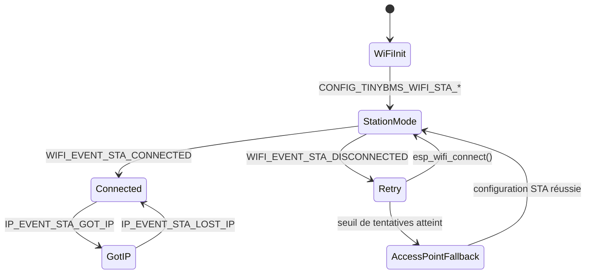

# Module `wifi`

## Références
- `main/wifi/wifi.h`
- `main/wifi/wifi.c`
- `main/include/app_events.h`
- `sdkconfig.defaults`

## Diagramme UML

## Rôle et responsabilités
Le module `wifi` encapsule la configuration et le suivi de l'interface Wi-Fi ESP-IDF. Il gère la connexion en mode station à un point d'accès configuré, assure un mécanisme de repli en point d'accès (AP) facultatif et publie des évènements de connectivité sur le bus applicatif (`APP_EVENT_ID_WIFI_*`).

## Configuration
Les paramètres proviennent des options `CONFIG_TINYBMS_WIFI_*` (définies via `sdkconfig` ou `sdkconfig.defaults`) : SSID, mot de passe, hostname, nombre maximal de tentatives, configuration AP fallback (SSID, mot de passe, canal, nombre de clients).

## Séquence d'initialisation
1. `wifi_set_event_publisher()` stocke le crochet de publication.
2. `wifi_init()` exécute :
   - Initialisation NVS si nécessaire (`nvs_flash_init()`), création des interfaces réseau `esp_netif_create_default_wifi_sta()` / `_ap()`.
   - `esp_event_loop_create_default()` et enregistrement des gestionnaires `wifi_event_handler`/`ip_event_handler`.
   - Configuration du mode station (`wifi_config_t`) et démarrage `esp_wifi_start()`.
   - Publication immédiate de l'évènement `APP_EVENT_ID_WIFI_STA_START` via le bus.

## Gestion des évènements ESP-IDF
- **`WIFI_EVENT_STA_START`** : déclenche `esp_wifi_connect()` et publie `APP_EVENT_ID_WIFI_STA_START`.
- **`WIFI_EVENT_STA_CONNECTED`** : remet à zéro le compteur de tentatives, arrête le fallback AP si actif, publie `APP_EVENT_ID_WIFI_STA_CONNECTED`.
- **`WIFI_EVENT_STA_DISCONNECTED`** : incrémente le compteur, tente une reconnexion jusqu'à `CONFIG_TINYBMS_WIFI_STA_MAX_RETRY`, puis déclenche le fallback AP si activé (`CONFIG_TINYBMS_WIFI_AP_FALLBACK`). Publie `APP_EVENT_ID_WIFI_STA_DISCONNECTED`.
- **`IP_EVENT_STA_GOT_IP`** : publie `APP_EVENT_ID_WIFI_STA_GOT_IP` et journalise l'adresse IPv4.
- **`IP_EVENT_STA_LOST_IP`** : publie `APP_EVENT_ID_WIFI_STA_LOST_IP`.
- **AP fallback** : `WIFI_EVENT_AP_START/STOP`, `WIFI_EVENT_AP_STACONNECTED` et `WIFI_EVENT_AP_STADISCONNECTED` publient respectivement `APP_EVENT_ID_WIFI_AP_*`.

## Publication d'évènements
`wifi_publish_event()` construit un `event_bus_event_t` sans payload et l'envoie avec un timeout de 25 ms. Les consommateurs incluent :
- `mqtt_gateway`, qui ne démarre la connexion que si `wifi_connected == true`.
- `web_server`, pour refléter l'état réseau dans `/api/status`.

## Fonctionnement du fallback AP
- Activé via `CONFIG_TINYBMS_WIFI_AP_FALLBACK`.
- Démarré après `CONFIG_TINYBMS_WIFI_STA_MAX_RETRY` échecs consécutifs.
- Configure un SSID/pwd distincts, éventuellement en mode ouvert si le mot de passe est absent ou trop court (<8 caractères).
- Stoppe le mode station avant de lancer `esp_wifi_set_mode(WIFI_MODE_AP)`.

## Gestion des erreurs
- Les appels ESP-IDF sont encapsulés dans `ESP_ERROR_CHECK`, ce qui entraîne un redémarrage en cas d'échec critique.
- Les échecs non critiques (ex : `esp_wifi_connect`) sont consignés via `ESP_LOGW` mais n'interrompent pas la boucle de reconnexion.

## Extensibilité
Pour intégrer un nouveau mode (par ex. STA+AP simultané) :
1. Étendre la machine d'états dans `wifi_event_handler()`.
2. Ajuster la publication d'évènements pour refléter les nouveaux états.
3. Ajouter la configuration correspondante dans `sdkconfig.defaults` et documenter les options.
